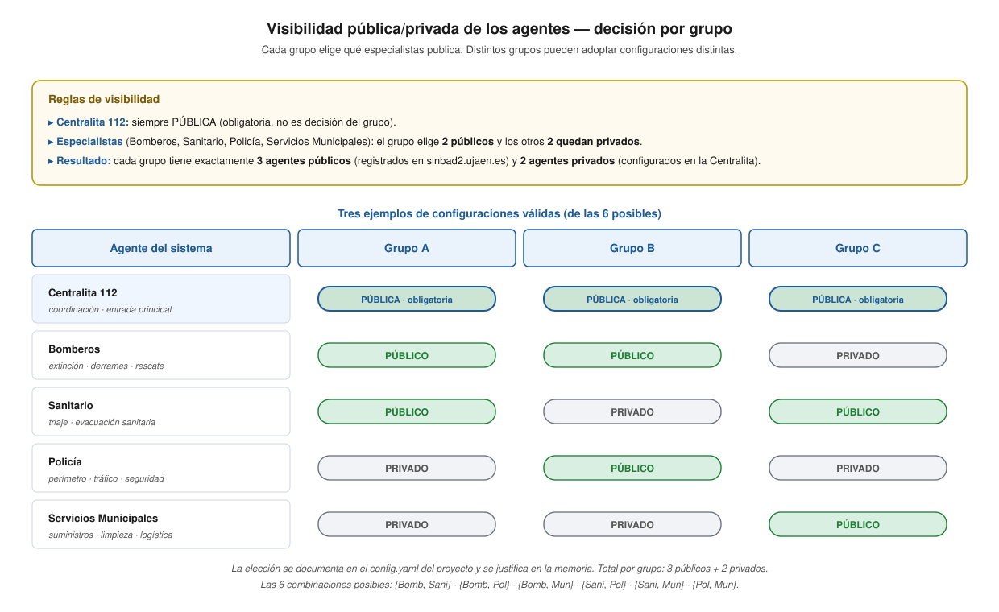
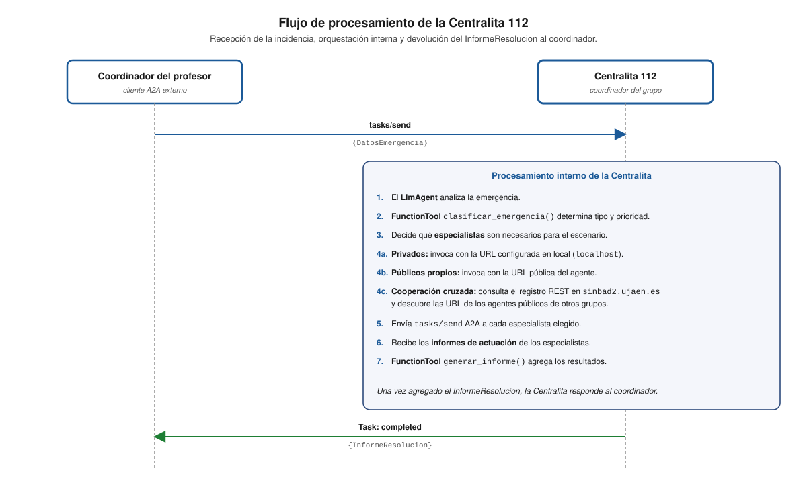
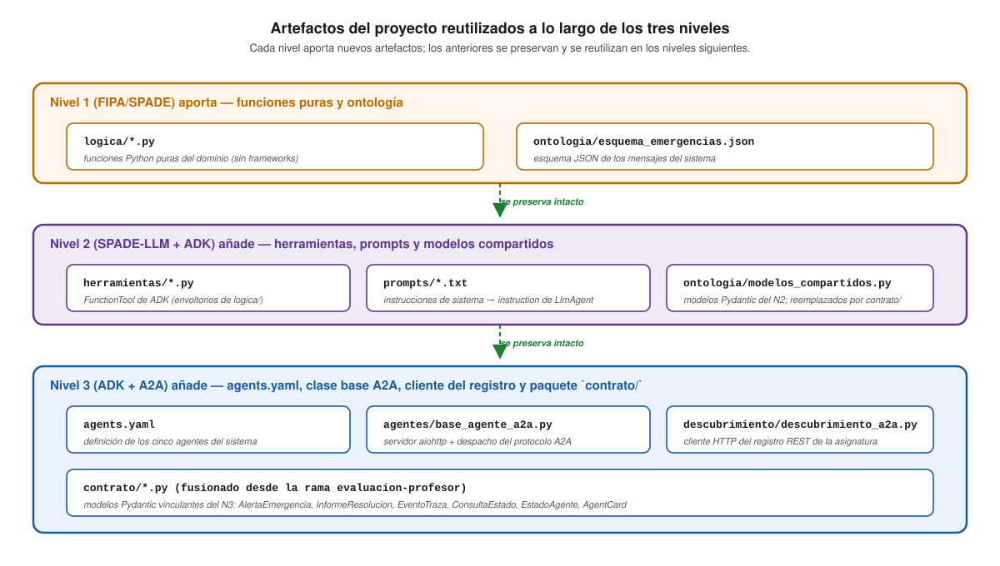

# Agentes A2A de Villa Olivar

## Documentación de los cinco agentes de emergencias sobre protocolo A2A

---

## 1. Visión general

El sistema de emergencias de Villa Olivar consta de **cinco agentes especializados** que cooperan para gestionar incidentes. En el Nivel 3, cada agente se despliega como un **servidor HTTP independiente** sobre el protocolo A2A, escuchando en uno de los puertos del bloque que el grupo tiene asignado dentro del rango `8100-8200` (por ejemplo, G1 → `8110-8114`).

> **Cómo se implementan estos agentes.** Las fichas funcionales
> de este documento describen *qué* hace cada rol. El *cómo*
> construirlos sobre el esqueleto común
> [`agentes/base_agente_a2a.py`](../agentes/base_agente_a2a.py)
> (composición ADK + A2A, despacho JSON-RPC, ciclo de vida,
> registro REST, Contract Net) está descrito paso a paso en
> [`guia_base_agente_a2a.md`](guia_base_agente_a2a.md). Esa guía
> fija además las convenciones de nombres y firmas que hacen que
> la migración posterior al esqueleto alternativo
> `factoria.AgenteA2A` de la rama `examen-alumno` sea mecánica.

Los cinco roles son:

| # | Rol | Función principal |
|---|-----|-------------------|
| 1 | **Centralita 112** | Recibe alertas, clasifica, envía a especialistas y agrega informes. Es la entrada principal del sistema. |
| 2 | **Bomberos** | Extinción de incendios, control de derrames químicos y operaciones de rescate. |
| 3 | **Sanitario** | Triaje de víctimas, atención sanitaria y evacuación a hospitales. |
| 4 | **Policía** | Establecimiento de perímetros, control de tráfico y seguridad ciudadana. |
| 5 | **Servicios Municipales** | Gestión de suministros (agua, gas, electricidad), limpieza y apoyo logístico. |

### 1.1. Visibilidad pública/privada — decisión por grupo

Una decisión arquitectónica clave del Nivel 3 es **qué agentes del grupo se publican** en el registro central (y por tanto pueden cooperar con agentes de otros grupos) y cuáles permanecen como **exclusivos del grupo** (sólo accesibles desde la propia Centralita).



**Reglas:**

- La **Centralita 112** es **siempre pública**. No es una decisión del grupo: es la entrada principal del sistema y debe ser alcanzable por el coordinador del profesor y por las Centralitas de otros grupos.
- De los **cuatro especialistas restantes** (Bomberos, Sanitario, Policía, Servicios Municipales), cada grupo elige **dos** que serán **públicos** y los otros **dos** quedan **privados**.
- **Resultado por grupo:** exactamente **3 agentes públicos** (la Centralita más los dos especialistas elegidos) y **2 agentes privados**.
- Las 6 combinaciones posibles de pares de especialistas son `{Bomberos, Sanitario}`, `{Bomberos, Policía}`, `{Bomberos, Municipal}`, `{Sanitario, Policía}`, `{Sanitario, Municipal}` y `{Policía, Municipal}`. **Distintos grupos pueden adoptar combinaciones distintas**.
- La elección se materializa en el `config.yaml` del proyecto del grupo y se justifica en la memoria.

**Implicaciones técnicas de la elección:**

- Los **públicos** escuchan en la **IP del PC en la red del aula** (alcanzables desde otros PC y otros grupos), publican su tarjeta de agente en `/.well-known/agent.json` y se dan de **alta en el registro** central de `sinbad2.ujaen.es` con su `IP:puerto`. Mientras están operativos mantienen una **señal de vida** (*heartbeat*) contra el registro y al apagarse se dan de **baja**.
- Los **privados** escuchan en `localhost`, no se registran en `sinbad2.ujaen.es` y **se configuran dentro del agente Centralita** del propio grupo (que es el único que necesita su localización para orquestar internamente).

### 1.2. Mapa de agentes — un ejemplo de configuración

El siguiente diagrama muestra un caso concreto en el que el grupo ha elegido **Bomberos y Sanitario** como especialistas públicos, y **Policía y Servicios Municipales** como privados:


Cualquiera de las otras cinco combinaciones produciría un diagrama análogo, intercambiando qué cajas están en la zona pública y cuáles en la privada.

### 1.3. Dependencias cruzadas entre roles

Las dependencias funcionales entre roles son el motor pedagógico del sistema y se mantienen **independientemente de la visibilidad** elegida (un especialista privado sigue colaborando con los demás del grupo a través de la Centralita):

| Agente | Depende de | Para |
|--------|-----------|------|
| Centralita | Todos | Recibir informes de actuación para generar el `InformeResolucion` |
| Bomberos | Policía | Solicitar perímetro de seguridad antes de intervenir |
| Bomberos | Sanitario | Solicitar asistencia para víctimas localizadas durante el rescate |
| Sanitario | Policía | Solicitar escolta para acceder a zonas peligrosas |
| Sanitario | Municipal | Solicitar ambulancias adicionales o helipuerto |
| Policía | Municipal | Solicitar cortes de tráfico y señalización |
| Municipal | Bomberos | Información sobre zonas afectadas para planificar restauración |

> **Nota pedagógica:** la elección de qué especialistas son públicos no afecta a las dependencias funcionales internas — esas se resuelven siempre dentro del grupo a través de la Centralita. La elección sí afecta a la **cooperación cruzada con otros grupos**: un especialista público puede ser invocado directamente desde la Centralita de otro grupo si el escenario inyectado por el coordinador así lo requiere.

---

## 2. Centralita 112 — siempre pública

### 2.1. Descripción

La Centralita 112 es el **agente coordinador** del sistema. Recibe alertas de emergencia del coordinador del profesor (o de otros sistemas), clasifica la emergencia, envía a los especialistas adecuados — públicos y privados, propios y, eventualmente, de otros grupos — y genera un informe de resolución.

**Visibilidad:** **PÚBLICA · obligatoria** en todos los grupos.

**Responsabilidad adicional respecto a los privados:** la Centralita conserva en su configuración interna las URL (`localhost:puerto`) de los agentes privados de su propio grupo, ya que es la única que necesita localizarlos y orquestarlos.

### 2.2. Tarjeta de agente

```json
{
  "name": "centralita_villa_olivar",
  "description": "Centralita 112 del sistema de emergencias de Villa Olivar. Recibe alertas, clasifica según tipo y prioridad, envía a especialistas (propios y de otros grupos cuando procede) y coordina la respuesta multiagente.",
  "url": "http://192.168.1.11:8110",
  "version": "1.0.0",
  "capabilities": {
    "streaming": true,
    "pushNotifications": false
  },
  "skills": [
    {
      "id": "clasificar_emergencia",
      "name": "Clasificación de emergencias",
      "description": "Analiza una alerta de emergencia y determina tipo (incendio, derrame, accidente, inundación, derrumbe), prioridad (baja, media, alta, crítica) y especialistas necesarios.",
      "tags": ["emergencia", "clasificacion", "triaje", "prioridad"]
    },
    {
      "id": "coordinar_respuesta",
      "name": "Coordinación de respuesta",
      "description": "Coordina la respuesta de los agentes especializados: envía alertas, recibe informes de actuación, agrega resultados y genera un informe de resolución completo.",
      "tags": ["coordinacion", "envio", "informe", "resolucion"]
    },
    {
      "id": "consultar_estado",
      "name": "Consulta de estado del sistema",
      "description": "Informa sobre el estado actual del sistema: emergencias activas, agentes disponibles y recursos desplegados.",
      "tags": ["estado", "monitorización", "disponibilidad"]
    }
  ],
  "defaultInputModes": ["application/json", "text/plain"],
  "defaultOutputModes": ["application/json"]
}
```

> El campo `url` es ilustrativo: cada grupo lo concreta con la IP del PC del alumno que ejecuta la Centralita y el puerto que le ha asignado en su `config.yaml`.

### 2.3. Herramientas (FunctionTool, preservadas del Nivel 2)

| Herramienta | Función de `logica/` | Descripción |
|-------------|---------------------|-------------|
| `clasificar_emergencia` | `logica_centralita.clasificar_emergencia()` | Determina tipo, prioridad y especialistas |
| `generar_informe` | `logica_centralita.generar_informe()` | Agrega informes parciales en `InformeResolucion` |

### 2.4. Instrucción de sistema

La instrucción de la Centralita (en `prompts/centralita.txt`, trasladada como `instruction` del `LlmAgent`) define:

- **Rol:** "Eres la Centralita 112 del sistema de emergencias de Villa Olivar."
- **Competencias:** clasificar emergencias, asignar prioridades, enviar a especialistas.
- **Formato de salida:** JSON conforme al modelo `InformeResolucion`.
- **Coordinación:** con quién se comunica (sus propios especialistas privados y públicos, las Centralitas de otros grupos cuando proceda) y para qué.
- **Ejemplos:** interacciones completas entrada/salida.

### 2.5. Flujo de procesamiento



---

## 3. Bomberos — visibilidad a elección del grupo

### 3.1. Descripción

El agente Bomberos es el especialista en **extinción de incendios, control de derrames químicos y rescate**. Evalúa riesgos, planifica intervenciones y coordina recursos de extinción.

**Visibilidad:** **PÚBLICO o PRIVADO** según decida el grupo. Si el grupo elige cooperar con otros grupos en escenarios de incendio o derrame (frecuentes en escenarios de cascada), suele convenir que sea público.

### 3.2. Tarjeta de agente (si el grupo lo publica)

```json
{
  "name": "bomberos_villa_olivar",
  "description": "Agente especialista en extinción de incendios, control de derrames químicos y operaciones de rescate del sistema de emergencias de Villa Olivar.",
  "url": "http://192.168.1.11:8111",
  "version": "1.0.0",
  "capabilities": {
    "streaming": true,
    "pushNotifications": false
  },
  "skills": [
    {
      "id": "evaluar_riesgo",
      "name": "Evaluación de riesgo",
      "description": "Evalúa el nivel de riesgo de un incidente (incendio, derrame, derrumbe) considerando materiales, extensión y proximidad a población.",
      "tags": ["emergencia", "riesgo", "evaluacion", "incendio", "derrame"]
    },
    {
      "id": "planificar_intervencion",
      "name": "Planificación de intervención",
      "description": "Diseña un plan de intervención incluyendo recursos necesarios, rutas de acceso, puntos de agua y estrategia de extinción o contención.",
      "tags": ["intervencion", "planificacion", "extincion", "contencion"]
    },
    {
      "id": "solicitar_recurso",
      "name": "Solicitud de recursos",
      "description": "Gestiona peticiones de recursos a otros agentes: perímetro de seguridad a Policía, asistencia sanitaria para víctimas encontradas durante rescate.",
      "tags": ["recursos", "coordinacion", "apoyo"]
    }
  ],
  "defaultInputModes": ["application/json", "text/plain"],
  "defaultOutputModes": ["application/json"]
}
```

> Si el grupo decide hacer Bomberos **privado**, no se publica esta tarjeta y el agente sólo es invocable desde la Centralita del propio grupo.

### 3.3. Herramientas

| Herramienta | Función de `logica/` | Descripción |
|-------------|---------------------|-------------|
| `evaluar_riesgo` | `logica_bomberos.evaluar_riesgo()` | Evalúa nivel de riesgo del incidente |
| `planificar_intervencion` | `logica_bomberos.planificar_intervencion()` | Diseña plan de intervención |

### 3.4. Tipos de emergencia

| Tipo | Acciones principales | Dependencias cruzadas |
|------|---------------------|----------------------|
| Incendio | Extinción, ventilación, rescate | Policía (perímetro), Sanitario (víctimas) |
| Derrame químico | Contención, neutralización, descontaminación | Policía (perímetro amplio), Sanitario (intoxicados) |
| Derrumbe | Apuntalamiento, rescate entre escombros | Sanitario (heridos), Municipal (maquinaria pesada) |

---

## 4. Sanitario — visibilidad a elección del grupo

### 4.1. Descripción

El agente Sanitario es el especialista en **atención sanitaria de emergencias**. Realiza triaje de víctimas, gestiona evacuaciones y coordina recursos médicos.

**Visibilidad:** **PÚBLICO o PRIVADO** según decida el grupo. Conviene que sea público si el grupo prevé escenarios con cooperación interhospitalaria entre grupos.

### 4.2. Tarjeta de agente (si el grupo lo publica)

```json
{
  "name": "sanitario_villa_olivar",
  "description": "Agente especialista en atención sanitaria de emergencias: triaje de víctimas, atención in situ, evacuación y coordinación de recursos médicos.",
  "url": "http://192.168.1.11:8112",
  "version": "1.0.0",
  "capabilities": {
    "streaming": true,
    "pushNotifications": false
  },
  "skills": [
    {
      "id": "calcular_triaje",
      "name": "Triaje de víctimas",
      "description": "Clasifica víctimas según gravedad (verde, amarillo, rojo, negro) y prioriza la atención médica.",
      "tags": ["sanitario", "triaje", "victimas", "clasificacion"]
    },
    {
      "id": "gestionar_evacuacion",
      "name": "Gestión de evacuación sanitaria",
      "description": "Planifica la evacuación de heridos: asignación de ambulancias, hospitales de destino y rutas de evacuación.",
      "tags": ["evacuacion", "ambulancia", "hospital", "transporte"]
    },
    {
      "id": "evaluar_riesgo_sanitario",
      "name": "Evaluación de riesgo sanitario",
      "description": "Evalúa riesgos sanitarios derivados de la emergencia: exposición a sustancias tóxicas, riesgo de epidemia, necesidad de descontaminación.",
      "tags": ["riesgo", "sanitario", "toxico", "descontaminacion"]
    }
  ],
  "defaultInputModes": ["application/json", "text/plain"],
  "defaultOutputModes": ["application/json"]
}
```

### 4.3. Herramientas

| Herramienta | Función de `logica/` | Descripción |
|-------------|---------------------|-------------|
| `calcular_triaje` | `logica_sanitario.calcular_triaje()` | Clasifica víctimas por gravedad |
| `gestionar_evacuacion` | `logica_sanitario.gestionar_evacuacion()` | Planifica evacuación de heridos |

---

## 5. Policía — visibilidad a elección del grupo

### 5.1. Descripción

El agente Policía es el especialista en **seguridad, control de accesos y gestión del tráfico**. Establece perímetros de seguridad, gestiona evacuaciones de la zona y controla el acceso de vehículos de emergencia.

**Visibilidad:** **PÚBLICO o PRIVADO** según decida el grupo. Tiende a ser privado si el grupo lo concibe como apoyo logístico interno; público si quiere ofrecer escolta y perímetros a grupos vecinos.

### 5.2. Tarjeta de agente (si el grupo lo publica)

```json
{
  "name": "policia_villa_olivar",
  "description": "Agente especialista en seguridad pública: establecimiento de perímetros, control de accesos, gestión de tráfico y protección de la zona de emergencia.",
  "url": "http://192.168.1.11:8113",
  "version": "1.0.0",
  "capabilities": {
    "streaming": true,
    "pushNotifications": false
  },
  "skills": [
    {
      "id": "establecer_perimetro",
      "name": "Establecimiento de perímetro",
      "description": "Define y establece un perímetro de seguridad alrededor de la zona de emergencia, con puntos de control de acceso.",
      "tags": ["seguridad", "perimetro", "control", "acceso"]
    },
    {
      "id": "gestionar_trafico",
      "name": "Gestión de tráfico",
      "description": "Planifica desvíos de tráfico, rutas alternativas y carriles de emergencia para facilitar el acceso de vehículos de emergencia.",
      "tags": ["trafico", "desvio", "ruta", "emergencia"]
    },
    {
      "id": "coordinar_evacuacion_civil",
      "name": "Evacuación civil",
      "description": "Coordina la evacuación de civiles de la zona afectada: puntos de reunión, rutas de evacuación y recuento de personas.",
      "tags": ["evacuacion", "civiles", "reunion", "seguridad"]
    }
  ],
  "defaultInputModes": ["application/json", "text/plain"],
  "defaultOutputModes": ["application/json"]
}
```

### 5.3. Herramientas

| Herramienta | Función de `logica/` | Descripción |
|-------------|---------------------|-------------|
| `establecer_perimetro` | `logica_policia.establecer_perimetro()` | Define perímetro de seguridad |
| `gestionar_trafico` | `logica_policia.gestionar_trafico()` | Planifica desvíos de tráfico |

---

## 6. Servicios Municipales — visibilidad a elección del grupo

### 6.1. Descripción

El agente de Servicios Municipales es el especialista en **infraestructuras, servicios públicos y restauración**. Gestiona cortes de suministros, limpieza de zonas afectadas y restauración de servicios.

**Visibilidad:** **PÚBLICO o PRIVADO** según decida el grupo. Suele ser privado en grupos centrados en la coordinación interna; público si se prevén escenarios donde otros grupos requieran maquinaria pesada o cortes de suministros en zonas limítrofes.

### 6.2. Tarjeta de agente (si el grupo lo publica)

```json
{
  "name": "municipal_villa_olivar",
  "description": "Agente de Servicios Municipales: gestión de infraestructuras, cortes de suministros, limpieza de zonas afectadas, restauración de servicios públicos y apoyo logístico.",
  "url": "http://192.168.1.11:8114",
  "version": "1.0.0",
  "capabilities": {
    "streaming": true,
    "pushNotifications": false
  },
  "skills": [
    {
      "id": "gestionar_suministros",
      "name": "Gestión de suministros",
      "description": "Coordina cortes y restauración de suministros (agua, gas, electricidad) en la zona afectada.",
      "tags": ["suministros", "agua", "gas", "electricidad", "corte"]
    },
    {
      "id": "planificar_limpieza",
      "name": "Planificación de limpieza",
      "description": "Planifica la limpieza y descontaminación de la zona afectada tras la emergencia, incluyendo gestión de residuos peligrosos.",
      "tags": ["limpieza", "descontaminacion", "residuos", "restauracion"]
    },
    {
      "id": "apoyo_logistico",
      "name": "Apoyo logístico",
      "description": "Proporciona apoyo logístico: maquinaria pesada, señalización temporal, alumbrado de emergencia y refugio temporal para evacuados.",
      "tags": ["logistica", "maquinaria", "señalizacion", "refugio"]
    }
  ],
  "defaultInputModes": ["application/json", "text/plain"],
  "defaultOutputModes": ["application/json"]
}
```

### 6.3. Herramientas

| Herramienta | Función de `logica/` | Descripción |
|-------------|---------------------|-------------|
| `gestionar_suministros` | `logica_municipal.gestionar_suministros()` | Coordina cortes y restauración |
| `planificar_limpieza` | `logica_municipal.planificar_limpieza()` | Planifica limpieza post-emergencia |

---

## 7. Definición de los agentes en `agents.yaml`

La elección de qué dos especialistas son públicos se materializa en el fichero `agents.yaml` del proyecto. Cada agente declara su `rol`, su `visibilidad` y su `puerto`; la Centralita recibe en `parametros.privados` la URL local de los especialistas privados que orquesta directamente:

```yaml
agentes:
  - identificador: "centralita"
    rol: "centralita"
    visibilidad: "publico"        # OBLIGATORIO en todos los grupos
    puerto: 8110
    modulo: "agentes.agente_centralita"
    clase: "AgenteCentralita"
    activo: true
    parametros:
      privados:
        policia: "http://127.0.0.1:8140"
        municipal: "http://127.0.0.1:8150"

  - identificador: "bomberos"
    rol: "bomberos"
    visibilidad: "publico"        # decisión del grupo
    puerto: 8120
    modulo: "agentes.agente_bomberos"
    clase: "AgenteBomberos"
    activo: true

  # ... sanitario (publico), policia (privado), municipal (privado) ...
```

**Reglas que el grupo debe respetar:**

- La Centralita declara siempre `visibilidad: "publico"`.
- Exactamente **dos** especialistas con `visibilidad: "publico"`.
- Exactamente **dos** especialistas con `visibilidad: "privado"`.
- El bloque `parametros.privados` de la Centralita enumera precisamente los dos privados con su URL en `127.0.0.1`.

El host de cada agente lo resuelve `main.py` a partir de la visibilidad y de la sección `a2a` de `config.yaml`; no se declara en `agents.yaml`. La tarjeta de agente no es un fichero JSON: se compone por código en el método `construir_agent_card` (ver `doc/guia_base_agente_a2a.md`).

---

## 8. Evolución de los agentes a través de los niveles

### 8.1. Tabla comparativa

| Aspecto | Nivel 1 | Nivel 2 | Nivel 3 |
|---------|---------|---------|---------|
| **Clase base** | `spade.agent.Agent` | `AgenteVillaOlivarLLM` (→ `LLMAgent`) | `BaseAgenteA2A` (servidor `aiohttp`) + `LlmAgent` ADK |
| **Identidad** | JID XMPP | JID XMPP | URL HTTP + tarjeta de agente |
| **Razonamiento** | `if/elif` determinista | `llm_chat()` con LLM | `LlmAgent` con `instruction` |
| **Herramientas** | Behaviours SPADE | `FunctionTool` ADK | `FunctionTool` ADK (preservadas) |
| **Comunicación** | FIPA-ACL sobre XMPP | FIPA-ACL sobre XMPP | Tareas A2A sobre HTTP |
| **Descubrimiento** | DF + MUC | DF + MUC | Tarjetas de agente + registro REST |
| **Despliegue** | Proceso compartido | Proceso compartido | Servidor HTTP por agente |
| **Visibilidad** | Todos en el mismo bus XMPP | Todos en el mismo bus XMPP | 3 públicos / 2 privados por grupo |

### 8.2. Lo que se reutiliza de cada nivel



---

## 9. Escenarios de prueba

Los escenarios se diseñan teniendo en cuenta la frontera público/privado de cada grupo: un escenario que requiera coordinarse con un grupo cuyo Sanitario sea privado deberá hacerlo a través de su Centralita.

### 9.1. Escenario interno: derrame químico resuelto dentro del grupo

Un escenario completo que involucra a todos los agentes del grupo (públicos y privados):

1. El coordinador del profesor envía `DatosEmergencia` con `tipo_emergencia: "derrame_quimico"` a la Centralita.
2. La Centralita clasifica como prioridad "crítica" y envía a sus cuatro especialistas (sin importar la visibilidad).
3. Bomberos (público o privado) evalúa el riesgo y planifica la contención.
4. Bomberos solicita a Policía (vía la Centralita si es privada) el establecimiento de perímetro amplio.
5. Sanitario evalúa el riesgo de intoxicación y prepara triaje.
6. Policía establece perímetro y desvía tráfico.
7. Municipal corta el suministro de agua en la zona y prepara equipos de limpieza.
8. Cada especialista envía su informe de actuación a la Centralita.
9. La Centralita genera el `InformeResolucion` y lo devuelve al coordinador.

### 9.2. Escenario en cascada: incendio con propagación

Un escenario que prueba la actualización dinámica de informes:

1. Incendio declarado en una nave industrial.
2. Bomberos detecta víctimas atrapadas → solicita asistencia a Sanitario.
3. El fuego se propaga a la calle → la Centralita pide a Policía ampliar perímetro.
4. Se detecta que la nave almacena productos químicos → Bomberos actualiza la clasificación a derrame.
5. Municipal corta gas y electricidad en la zona.
6. Sanitario solicita ambulancias adicionales a Municipal.
7. Todos los agentes actualizan sus informes a la Centralita.

### 9.3. Escenario de cooperación cruzada entre grupos

Un escenario donde la Centralita debe consultar el **registro central** para descubrir agentes públicos de otros grupos:

1. La incidencia inyectada por el coordinador requiere recursos que el grupo no tiene (por ejemplo, helipuerto sanitario, maquinaria pesada o un perímetro extenso).
2. La Centralita consulta `GET /agentes` en `sinbad2.ujaen.es` y obtiene la lista de agentes públicos vigentes de todos los grupos.
3. La Centralita selecciona los agentes públicos relevantes de **otros grupos** (filtrando por rol y disponibilidad).
4. Envía Tasks A2A a esos agentes externos solicitando apoyo. Los agentes externos responden según su disponibilidad.
5. La Centralita agrega todas las respuestas (propias y externas) en un único `InformeResolucion` y lo envía al coordinador.

> **Importante:** la cooperación cruzada **sólo es posible con los agentes públicos** del otro grupo. Si el grupo destinatario tiene como privado el rol que se necesitaría, la cooperación se canaliza obligatoriamente a través de su Centralita (que sí es pública en todos los grupos).

---

*Documentación de agentes A2A — Proyecto Villa Olivar — Sistemas Multiagente — Universidad de Jaén*
