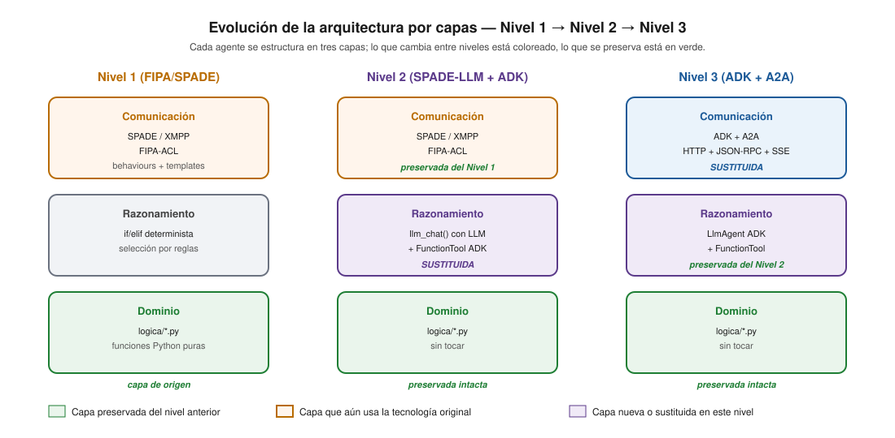
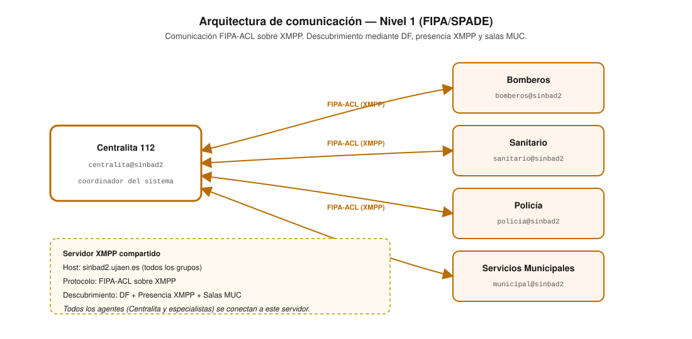
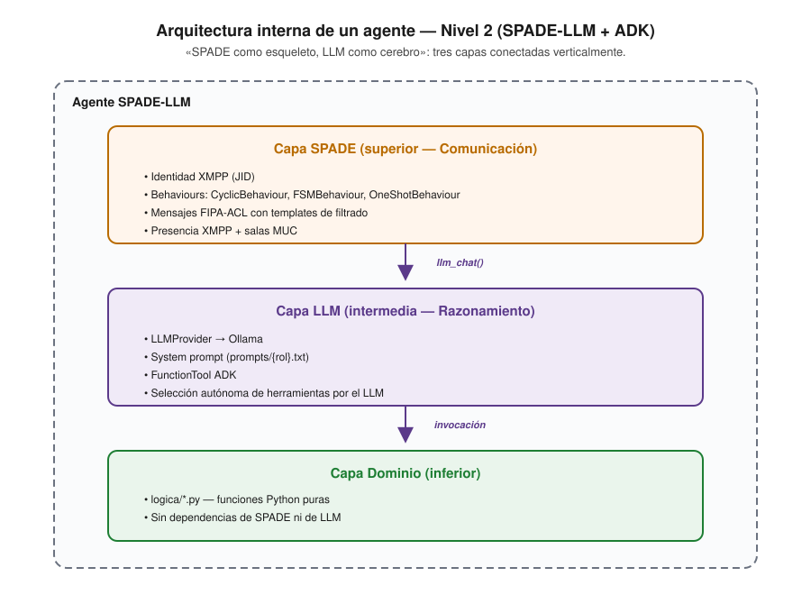
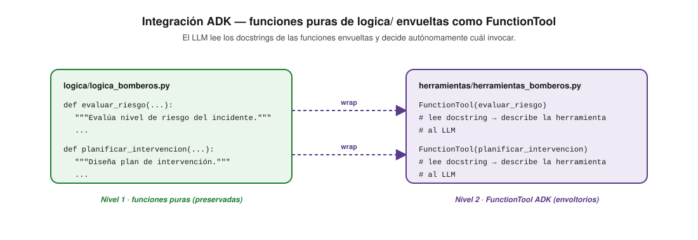
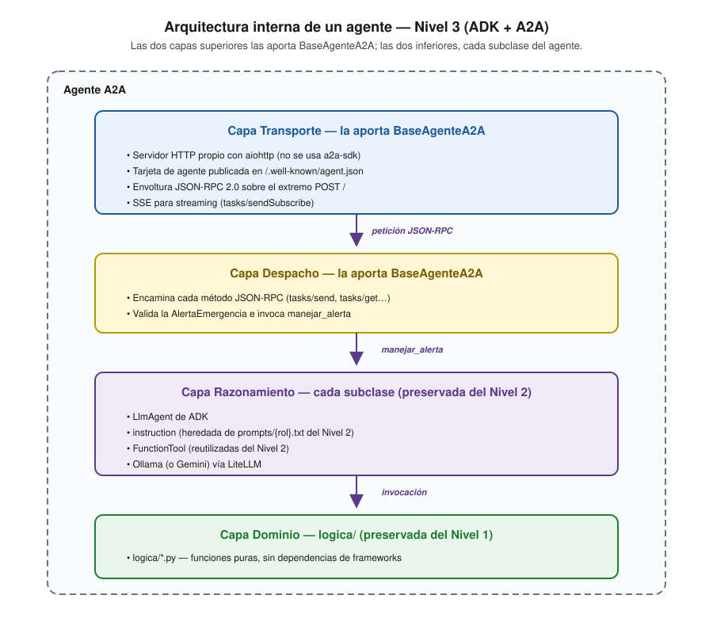
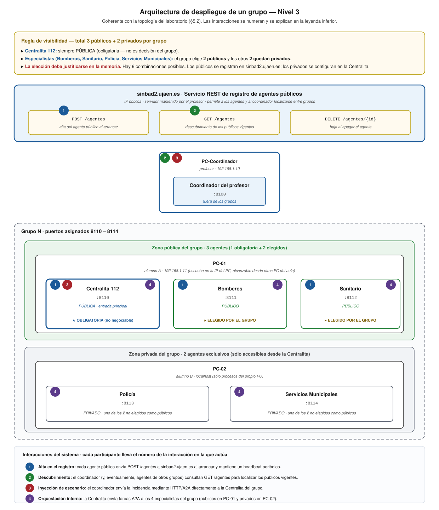
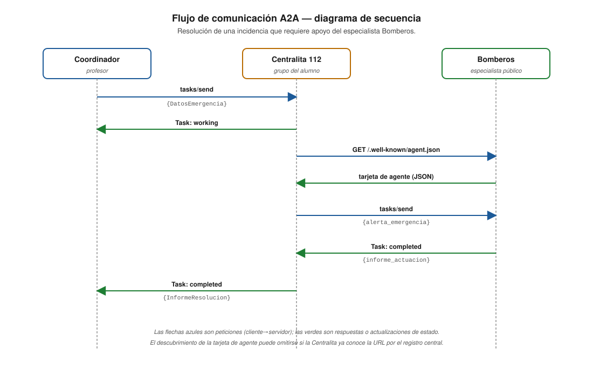
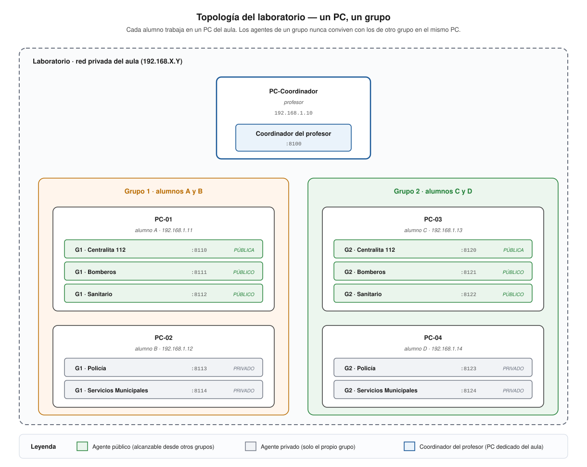
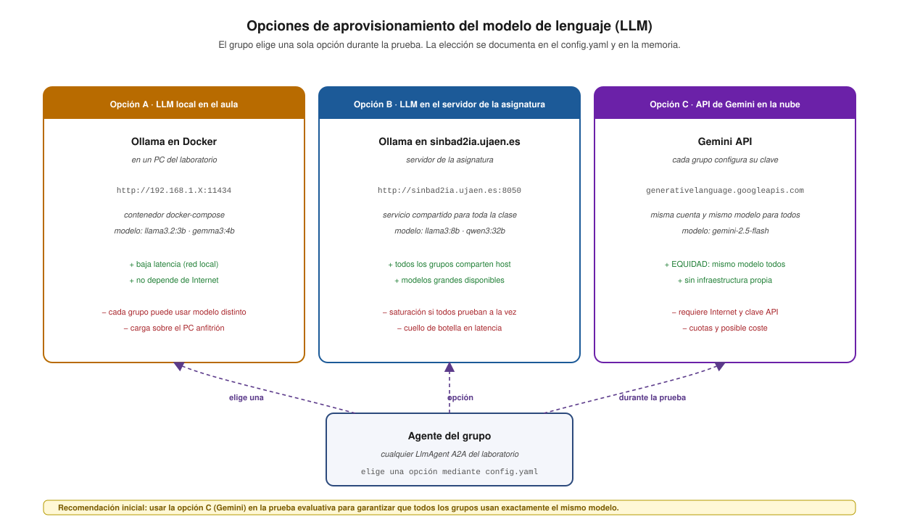
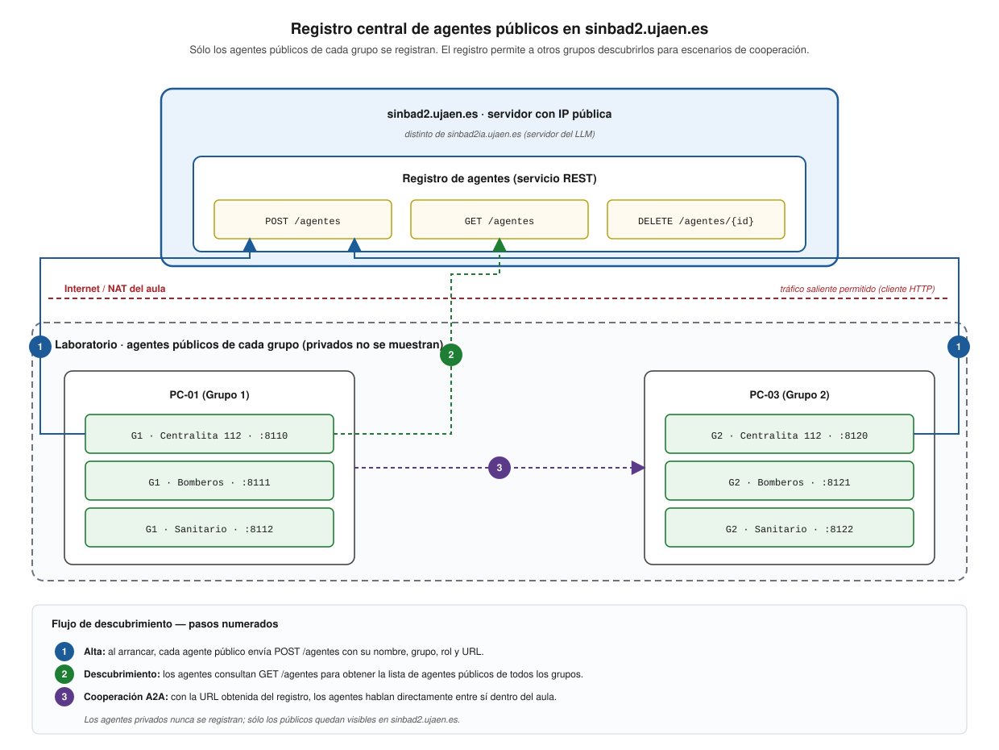

# Arquitectura del Proyecto Villa Olivar

## Evolución Nivel 1 → Nivel 2 → Nivel 3

**Proyecto:** Coordinación de Emergencias en Villa Olivar
**Asignatura:** Sistemas Multiagente — Universidad de Jaén
**Curso:** 2025-2026

---

## 1. Visión general

El sistema multiagente de Villa Olivar modela la coordinación de emergencias en una localidad ficticia. Cinco agentes especializados cooperan para gestionar incidentes: la Centralita 112 recibe y clasifica alertas, enviando a los especialistas (Bomberos, Sanitario, Policía, Servicios Municipales) según el tipo y gravedad de la emergencia.

A lo largo de los tres niveles de la asignatura, la **arquitectura interna** de cada agente ha evolucionado manteniendo una separación en capas que ha permitido reutilizar el trabajo de cada nivel en el siguiente:



---

## 2. Nivel 1 — Agentes FIPA con SPADE

### 2.1. Principio de diseño

El principio fundamental del Nivel 1 es la **separación entre lógica de dominio y plataforma de agentes**. Las funciones puras de `logica/` no importan SPADE ni ningún framework; son funciones Python puras que reciben datos y devuelven resultados. Los agentes SPADE las invocan desde sus behaviours.

### 2.2. Arquitectura de comunicación



### 2.3. Componentes clave

| Componente | Tecnología | Responsabilidad |
|------------|-----------|-----------------|
| Agentes | `spade.agent.Agent` | Identidad XMPP, ciclo de vida, behaviours |
| Behaviours | `CyclicBehaviour`, `OneShotBehaviour`, `FSMBehaviour` | Lógica de procesamiento de mensajes |
| Mensajes | FIPA-ACL con 12 campos | Comunicación tipada entre agentes |
| Ontología | `esquema_emergencias.json` (JSON Schema) | Vocabulario compartido |
| Descubrimiento | DF + Presencia XMPP + MUC | Localización de agentes |
| Dominio | `logica/*.py` | Funciones puras de dominio |

### 2.4. Flujo de un incidente (Nivel 1)

1. Un agente externo envía un mensaje FIPA-ACL con performativa `request` a la Centralita.
2. La Centralita extrae el contenido JSON y lo valida contra `esquema_emergencias.json`.
3. Un bloque `if/elif` determinista clasifica la emergencia y selecciona el especialista.
4. La Centralita envía un mensaje FIPA-ACL al especialista con performativa `request`.
5. El especialista procesa la petición invocando funciones de `logica/`.
6. El especialista responde con un mensaje FIPA-ACL con performativa `inform`.
7. La Centralita agrega las respuestas y responde al solicitante original.

---

## 3. Nivel 2 — Agentes LLM con SPADE-LLM y ADK

### 3.1. Principio de diseño

**«SPADE como esqueleto, LLM como cerebro».** Los agentes mantienen su infraestructura XMPP/FIPA-ACL del Nivel 1, pero sustituyen la lógica condicional `if/elif` por razonamiento LLM. Las funciones de `logica/` se envuelven como `FunctionTool` de Google ADK, dando «manos» al cerebro LLM.

### 3.2. Arquitectura interna de un agente



### 3.3. Integración ADK

Las funciones puras de `logica/` se envuelven como `FunctionTool` de ADK sin modificar su código:



El LLM lee los docstrings de las funciones envueltas para decidir autónomamente cuál invocar ante cada situación.

### 3.4. Flujo de un incidente (Nivel 2)

1. Un agente recibe un mensaje FIPA-ACL — **capa SPADE**.
2. Extrae el contenido y lo pasa a `llm_chat()` — **capa LLM**.
3. El LLM razona y decide invocar una `FunctionTool` — **capa LLM → ADK**.
4. La `FunctionTool` ejecuta la función de `logica/` — **capa Dominio**.
5. El resultado vuelve al LLM, que genera la respuesta — **capa LLM**.
6. El agente construye un mensaje FIPA-ACL y lo envía — **capa SPADE**.

---

## 4. Nivel 3 — Coordinación A2A con ADK

### 4.1. Principio de diseño

Los agentes se convierten en **servicios HTTP independientes** comunicados vía el protocolo A2A. Se abandona XMPP/FIPA-ACL y se adopta HTTP + JSON-RPC + SSE. Las capas de Dominio y Razonamiento se preservan; solo cambia la capa de Comunicación.

### 4.2. Arquitectura interna de un agente



### 4.3. Arquitectura distribuida

A diferencia de los niveles anteriores donde todos los agentes corrían en un mismo proceso Python compartiendo un servidor XMPP, en el Nivel 3 cada agente es un servidor HTTP independiente. La distribución, la frontera público/privado y los puertos asignados al grupo se ilustran en el diagrama del despliegue (ver §5.2 y el diagrama detallado siguiente):



### 4.4. Flujo de un incidente (Nivel 3)

1. El coordinador del profesor envía un Task A2A (`tasks/send`) a la Centralita.
2. La Centralita actualiza el Task a `working`.
3. El despacho JSON-RPC de la clase base valida la `AlertaEmergencia` y la entrega al método `manejar_alerta` de la Centralita.
4. El `LlmAgent` razona sobre la emergencia y decide qué especialistas contactar.
5. La Centralita descubre las Agent Cards de los especialistas relevantes.
6. La Centralita envía Tasks A2A a cada especialista.
7. Los especialistas procesan las peticiones con sus `LlmAgent` + `FunctionTool`.
8. Los especialistas responden con Tasks en estado `completed`.
9. La Centralita agrega las respuestas y actualiza el Task original a `completed`.
10. El coordinador recibe el `InformeResolucion` como `DataPart` del Task.

### 4.5. Flujo de comunicación A2A (detalle)



---

## 5. Despliegue del Nivel 3 en el laboratorio

Esta sección documenta la **arquitectura concreta de la prueba evaluativa** del Nivel 3, que se ejecuta sobre la red privada del aula del laboratorio.

### 5.1. Premisas del entorno

| # | Premisa | Implicación técnica |
|---|---------|---------------------|
| P1 | El laboratorio es una **red privada** del aula (rango 192.168.X.Y). | Los PC sólo son alcanzables entre sí dentro de esa red; el cortafuegos del aula bloquea el tráfico entrante desde Internet. |
| P2 | El **Coordinador del profesor se ejecuta en un PC del aula** (no en `sinbad2.ujaen.es`). | El Coordinador participa de la red privada como un agente más; no requiere NAT inverso ni túneles. |
| P3 | Cada **alumno trabaja en un PC** y **sólo ejecuta agentes de su grupo**. | Los agentes de grupos distintos nunca conviven en el mismo PC (un PC, un grupo). |
| P4 | Cada agente está marcado como **público** o **privado**. | Los públicos colaboran entre grupos; los privados son exclusivos del grupo. |
| P5 | El servidor **`sinbad2.ujaen.es`** (IP pública) hospeda el **registro de agentes públicos**. | Permite a los grupos descubrirse mutuamente para cooperar. |
| P6 | El servidor **`sinbad2ia.ujaen.es`** (distinto del anterior, también con IP pública) hospeda el **modelo de lenguaje (Ollama)** de la asignatura. | Es uno de los proveedores de LLM disponibles, no el único (ver §5.3). |
| P7 | El LLM puede aprovisionarse en **tres modalidades**: Ollama local, Ollama en `sinbad2ia` o **API de Gemini**. | La elección se documenta en `config.yaml` y en la memoria del grupo. |

### 5.2. Topología: un PC, un grupo



**Reglas de despliegue:**

- Un PC nunca aloja agentes de grupos distintos.
- Un grupo puede repartir sus cinco agentes entre uno o varios PC, según el número de alumnos del grupo. La asignación física se configura en el **`config.yaml` del proyecto**.
- La separación pública/privada del Nivel 3 se mantiene: los públicos escuchan en la **IP del PC en la red del aula** (alcanzables desde otros PC del aula), los privados sólo en `localhost` (alcanzables únicamente desde procesos del propio PC).
- Cada agente del grupo se asigna un puerto del bloque del grupo dentro del rango `8100-8200`. El bloque es de **diez puertos** por grupo (G1 → 8110-8119, G2 → 8120-8129, etc.). El Coordinador del profesor reserva el puerto `8100`.
- Los **agentes privados** de cada grupo (Policía, Servicios Municipales) **se configuran dentro del agente Centralita** del propio grupo, ya que la Centralita es la única que necesita conocer su localización: es ella quien orquesta y coordina internamente la actuación de los privados.

### 5.3. Aprovisionamiento del modelo de lenguaje (LLM)



| Opción | Endpoint típico | Pros | Contras |
|--------|-----------------|------|---------|
| **A. Ollama local en un PC del aula** | `http://192.168.1.X:11434` | Latencia muy baja (red local). No depende de Internet. | Cada grupo puede acabar usando un modelo distinto (poca equidad). Carga sobre el PC anfitrión. |
| **B. Ollama en `sinbad2ia.ujaen.es`** | `http://sinbad2ia.ujaen.es:8050` | Servicio centralizado mantenido por la asignatura. Modelos grandes (qwen3:32b). | Riesgo de saturación si toda la clase prueba a la vez. Cuello de botella en latencia. |
| **C. API de Gemini en la nube** | `generativelanguage.googleapis.com` | **Equidad garantizada**: todos los grupos consumen exactamente el mismo modelo. Capacidad elástica. | Requiere Internet y clave API. Cuotas y posible coste. |

**Configuración por defecto: Opción C (Gemini)** para la prueba evaluativa, por garantizar equidad entre grupos. **Recordatorio para el alumno:** debe configurar la **variable de entorno** que contiene la clave de la API antes de arrancar los agentes; sin esa variable la conexión fallará. Las opciones A y B siguen siendo válidas para desarrollo y depuración.

Extensión propuesta del `config.yaml`:

```yaml
llm:
  perfil_activo: "gemini"     # "ollama_local" | "ollama_servidor" | "gemini"
  perfiles:
    ollama_local:
      base_url: "http://192.168.1.10:11434"
      modelo: "ollama/llama3.2:3b"
    ollama_servidor:
      base_url: "http://sinbad2ia.ujaen.es:8050"
      modelo: "ollama/llama3:8b"
    gemini:
      api_key_env: "GOOGLE_API_KEY"
      modelo: "gemini/gemini-2.5-flash"
```

### 5.4. Registro central de agentes públicos



El servidor `sinbad2.ujaen.es` hospeda un **servicio REST** que actúa como directorio de agentes públicos. Sus extremos (*endpoints*):

- `POST /agentes` — alta de un agente público al arrancar.
- `GET /agentes` — consulta de la lista vigente de agentes públicos registrados.
- `DELETE /agentes/{id}` — baja explícita al apagarse.

**Esquema mínimo de un registro:**

```json
{
  "id": "g1.bomberos",
  "grupo": 1,
  "rol": "bomberos",
  "url": "http://192.168.1.11:8111",
  "agent_card": "http://192.168.1.11:8111/.well-known/agent.json",
  "alta": "2026-05-12T10:24:18Z"
}
```

La entrada del registro siempre incluye el par **`IP:puerto`** del agente, lo que da flexibilidad para que dos grupos distintos (con distinto `config.yaml`) puedan convivir sin colisionar en su asignación local.

**Flujo operativo durante la prueba:**

1. **Alta:** al arrancar, cada agente público envía `POST /agentes` con su URL del aula. La conectividad funciona porque el tráfico saliente desde el laboratorio hacia Internet está permitido.
2. **Señal de vida (*heartbeat*):** el agente público debe **demostrar periódicamente que sigue activo** contra el registro. Si deja de hacerlo en el plazo configurado, el registro **elimina automáticamente** la entrada.
3. **Descubrimiento:** cuando un agente necesita cooperar con otros grupos, consulta `GET /agentes` para obtener las URL públicas vigentes en ese momento.
4. **Cooperación A2A:** con la URL obtenida, los agentes se comunican **directamente** entre sí dentro de la red del aula. `sinbad2.ujaen.es` no participa en el plano de datos.
5. **Baja:** al apagarse ordenadamente, el agente envía `DELETE /agentes/{id}`.

**Privacidad:** los agentes **privados nunca se registran**. Se respeta así la frontera público/privado del Nivel 3: lo que vive en `sinbad2.ujaen.es` es exclusivamente la "yellow pages" de servicios cooperativos.

**Implementación del registro:** el servicio lo desarrolla el **profesor** y se incluirá en una rama de desarrollo del proyecto. El servidor `sinbad2.ujaen.es` lo tendrá activo durante la prueba evaluativa, y la misma utilidad se distribuirá dentro de un **contenedor Docker** para que los grupos puedan ejercitar el flujo en pruebas locales sin depender del servidor.

### 5.5. Cooperación cruzada entre grupos

La cooperación entre agentes de distintos grupos es uno de los objetivos pedagógicos del Nivel 3 (Hito 5). Sus reglas:

- La cooperación se **documenta** en la memoria y se **demuestra** en la implementación.
- La iniciativa la fija el **agente coordinador del profesor** en el momento de **inyectar la incidencia**: es el escenario inyectado el que determina si la resolución requiere consultar a agentes públicos de otros grupos o si se completa internamente al grupo.
- Sólo los agentes **públicos** participan en escenarios cruzados (los privados de un grupo no son visibles para otros grupos).
- La cooperación atraviesa el flujo: la Centralita consulta el registro, descubre URL públicas de otros grupos y envía Tasks A2A a los agentes correspondientes.

### 5.6. Rol del Coordinador del profesor

El Coordinador del profesor tiene un rol acotado:

- **Inyecta** las incidencias enviando Tasks A2A a la Centralita del grupo correspondiente.
- **Recibe** los informes de resolución como respuesta a esos Tasks.
- **No es localizable** por los demás agentes: no se publica en el registro, no expone su tarjeta de agente para descubrimiento. Actúa siempre como cliente que inicia la interacción.
- Adicionalmente puede **solicitar el estado** a cualquier agente que el grupo haya publicado en el registro, como verificación de disponibilidad.

### 5.7. Estructura común de configuración

Todos los proyectos de los grupos comparten **la misma estructura de `config.yaml`** (mismas claves, misma forma de definir perfiles XMPP/A2A, LLM, asignación de puertos, agentes activos, etc.). Esta uniformidad:

- Se materializa en la rama de desarrollo del proyecto que distribuye el profesor.
- Permite que el profesor pueda arrancar y evaluar cualquier grupo sin tener que aprender un esquema distinto cada vez.
- Facilita la migración entre los tres niveles de la asignatura: la sección de `config.yaml` que cambia es la mínima imprescindible.

---

## 6. Comparación de arquitecturas

### 6.1. Tabla comparativa por nivel

| Aspecto | Nivel 1 | Nivel 2 | Nivel 3 |
|---------|---------|---------|---------|
| **Framework** | SPADE 4.1.2 | SPADE-LLM + ADK | ADK + aiohttp |
| **Transporte** | XMPP (puerto 5222/8022) | XMPP (puerto 5222/8022) | HTTP (puertos 8000-8100) |
| **Protocolo** | FIPA-ACL | FIPA-ACL | A2A (JSON-RPC 2.0) |
| **Descubrimiento** | DF + MUC | DF + MUC | Agent Cards |
| **Razonamiento** | Determinista (if/elif) | LLM (Ollama) | LLM (Ollama) |
| **Herramientas** | Behaviours | FunctionTool ADK | FunctionTool ADK |
| **Despliegue** | Proceso único | Proceso único | Servidor HTTP por agente |
| **Transmisión continua** (*streaming*) | No | No | SSE |
| **Interoperabilidad** | Mismo servidor XMPP | Mismo servidor XMPP | HTTP estándar (entre grupos) |
| **Estándar** | IEEE FIPA (2005) | MCP (Anthropic, 2024) | A2A (Google/LF, 2025) |

### 6.2. Qué se preserva en cada transición

| Transición | Se preserva | Se modifica | Se añade |
|------------|-------------|-------------|----------|
| **Nivel 1 → 2** | `logica/*.py`, ontología JSON, behaviours, templates FIPA, descubrimiento | Herencia de agentes (`Agent` → `LLMAgent`), procesamiento de mensajes | `prompts/`, `herramientas/`, `LLMProvider`, Ollama, Docker |
| **Nivel 2 → 3** | `logica/*.py`, `herramientas/*.py`, `prompts/*.txt`, ontología Pydantic | Agentes (SPADE-LLM → ADK), comunicación (FIPA → A2A), descubrimiento (DF → Cards) | servidor `aiohttp`, despacho JSON-RPC propio, tarjeta de agente por código |

---

## 7. Decisiones de diseño transversales

### 7.1. Separación de capas

La decisión arquitectónica más importante del proyecto es la **separación estricta entre lógica de dominio y plataforma**. Las funciones de `logica/` no contienen `import spade`, `import spade_llm`, `import google.adk` ni `import a2a`. Son funciones Python puras que:

- Reciben datos nativos (strings, dicts, listas).
- Devuelven resultados nativos.
- No tienen efectos secundarios sobre la red ni el sistema de archivos.
- Son testables de forma unitaria sin levantar infraestructura.

Esta separación ha demostrado su valor en cada transición de nivel: el código de dominio se ha reutilizado intacto tres veces.

### 7.2. Ontología compartida

La ontología del sistema ha evolucionado tanto en formato como en
paquete a lo largo de los tres niveles:

| Nivel | Formato | Paquete y ficheros |
|-------|---------|--------------------|
| 1 | JSON Schema | `ontologia/esquema_emergencias.json` |
| 2 | JSON Schema + Pydantic (FIPA-ACL) | `ontologia/esquema_emergencias.json` + `ontologia/modelos_compartidos.py` |
| 3 | Pydantic A2A en paquete propio (`contrato/`) → DataPart | Paquete `contrato/` de la rama `evaluacion-profesor`, fusionado en `desarrollo-nivel3` y serializado como `DataPart` en los Tasks A2A. |

Los conceptos de dominio (alerta, informe, estado de agente,
participación) se mantienen a través de los tres niveles. **Lo
que cambia en el Nivel 3** es:

- Se sustituye el transporte FIPA-ACL/XMPP por HTTP/A2A.
- Se sustituyen los modelos `DatosEmergencia` / `RespuestaAgente`
  / `InformeResolucion` del Nivel 2 (en `ontologia/modelos_compartidos.py`)
  por `AlertaEmergencia` / `InformeActuacion` / `InformeResolucion`
  del Nivel 3 (en `contrato/`), con campos rediseñados para A2A:
  la alerta lleva un único `texto` libre (la Centralita
  clasifica), el informe lleva una `traza_participacion`
  obligatoria como evidencia para los hitos, y la `Ubicacion`
  pasa a tener `latitud` / `longitud` como floats opcionales en
  lugar de un sub-objeto `Coordenadas`.
- El paquete del Nivel 2 (`ontologia/`) **no se usa** en el
  contrato externo del Nivel 3; queda como referencia histórica
  para los proyectos que aún convivan con XMPP.

### 7.3. Configuración centralizada

El fichero `config.yaml` ha crecido en cada nivel, pero siempre manteniendo la misma estructura de perfiles:

- **Nivel 1:** perfiles XMPP (local vs. servidor).
- **Nivel 2:** perfiles XMPP + perfiles LLM.
- **Nivel 3:** perfiles XMPP (referencia) + perfiles LLM + perfiles A2A.

La regla de oro se mantiene: **ningún agente debe contener URL ni puertos escritos directamente en el código**. Todo se lee de `config.yaml`.

---

## 8. Patrones de coordinación

### 8.1. Patrón de envío

La Centralita actúa como coordinador central que recibe emergencias y las envía al especialista adecuado:

| Nivel | Implementación |
|-------|---------------|
| 1 | `if tipo == "incendio": enviar_a(bomberos)` |
| 2 | El LLM decide a quién enviar basándose en el prompt y las FunctionTool |
| 3 | La Centralita descubre Agent Cards y envía Tasks A2A al especialista con skills relevantes |

### 8.2. Patrón Contract Net

La negociación entre agentes se ha implementado de forma progresiva:

| Nivel | Implementación |
|-------|---------------|
| 1 | FSMBehaviour con estados de propuesta/aceptación/rechazo sobre FIPA-ACL |
| 2 | El LLM genera propuestas y evalúa respuestas de otros agentes |
| 3 | Tasks A2A individuales a cada especialista, comparación de propuestas por la Centralita |

### 8.3. Patrón de consulta de estado

El supervisor/coordinador puede consultar el estado de cualquier agente:

| Nivel | Implementación |
|-------|---------------|
| 1 | Mensaje FIPA-ACL con performativa `query-ref` |
| 2 | Mensaje FIPA-ACL con modelo Pydantic `ConsultaEstado` / `EstadoAgente` |
| 3 | Task A2A con `tasks/get` para consultar estado del Task |

---

*Documento de arquitectura — Proyecto Villa Olivar — Sistemas Multiagente — Universidad de Jaén*
