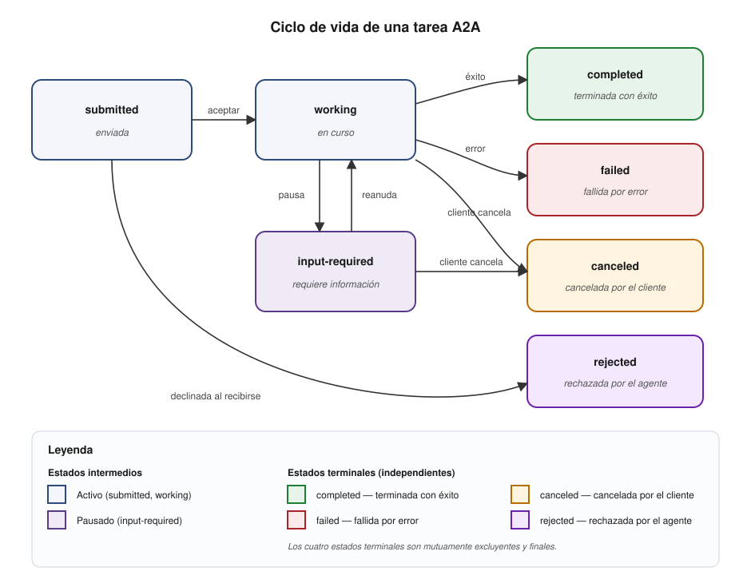
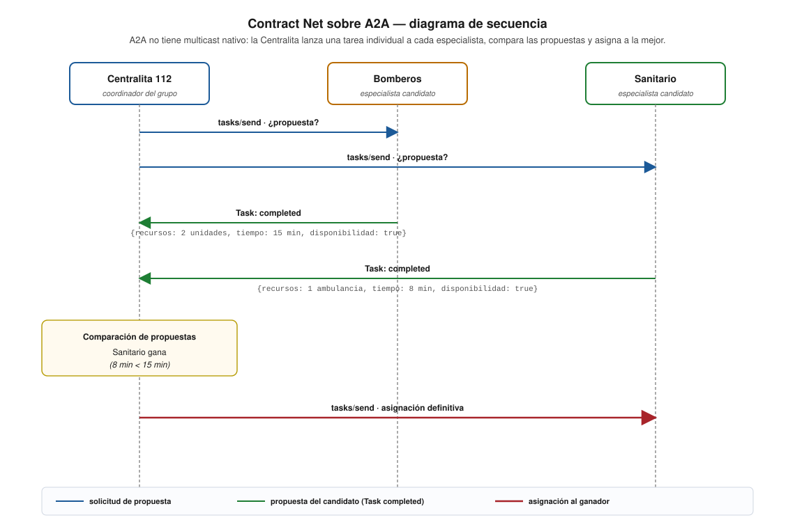

# Protocolo A2A en Villa Olivar

## Documentación del protocolo Agent-to-Agent aplicado al sistema de emergencias

---

## 1. Introducción al protocolo A2A

### 1.1. Origen y contexto

El protocolo **A2A (Agent-to-Agent)** fue creado por Google en abril de 2025 y donado a la Linux Foundation. Con más de 150 organizaciones respaldándolo, A2A es el estándar emergente para la comunicación entre agentes de IA independientes.

A2A complementa al protocolo MCP (Model Context Protocol) del Nivel 2:

- **MCP** estandariza cómo un agente accede a herramientas externas (agente → herramienta).
- **A2A** estandariza cómo agentes independientes se comunican entre sí (agente ↔ agente).

### 1.2. Relación con FIPA

A2A resuelve los mismos problemas fundamentales que FIPA resolvió en 1996, pero con abstracciones modernas:

| Problema fundamental | Solución FIPA (1996) | Solución A2A (2025) |
|---------------------|---------------------|---------------------|
| ¿Cómo se identifica un agente? | JID XMPP (`rol@servidor`) | URL HTTP (`http://host:puerto`) |
| ¿Cómo se descubren capacidades? | Directory Facilitator (DF) | Agent Card (`/.well-known/agent.json`) |
| ¿Cómo se estructura un mensaje? | FIPA-ACL (12 campos, performativas) | Task A2A (JSON-RPC 2.0, estados) |
| ¿Cómo se negocia? | Contract Net Protocol (FIPA-00029) | Tasks individuales + comparación |
| ¿Cómo se comparte vocabulario? | Ontologías FIPA | Skills + DataPart + JSON Schema |
| ¿Quién gestiona el ciclo de vida? | Agent Management System (AMS) | Infraestructura (Docker, K8s) |

---

## 2. Conceptos fundamentales

### 2.1. Agent Card

La Agent Card es un documento JSON que describe la identidad, capacidades y extremo (*endpoint*) de un agente. Se publica en la URL estándar `/.well-known/agent.json` para que otros agentes la descubran.

**Estructura de una Agent Card:**

```json
{
  "name": "centralita_villa_olivar",
  "description": "Centralita 112 del sistema de emergencias de Villa Olivar. Recibe alertas, clasifica emergencias y coordina la respuesta de los agentes especializados.",
  "url": "http://localhost:8010",
  "version": "1.0.0",
  "capabilities": {
    "streaming": true,
    "pushNotifications": false
  },
  "skills": [
    {
      "id": "clasificar_emergencia",
      "name": "Clasificación de emergencias",
      "description": "Analiza una alerta de emergencia y determina su tipo, prioridad y especialistas necesarios",
      "tags": ["emergencia", "clasificacion", "triaje"]
    },
    {
      "id": "coordinar_respuesta",
      "name": "Coordinación de respuesta",
      "description": "Coordina la respuesta de los agentes especializados y genera un informe de resolución",
      "tags": ["coordinacion", "envio", "informe"]
    }
  ],
  "defaultInputModes": ["application/json", "text/plain"],
  "defaultOutputModes": ["application/json"]
}
```

**Campos obligatorios:**

| Campo | Tipo | Descripción |
|-------|------|-------------|
| `name` | string | Identificador único del agente (equivale al JID en SPADE) |
| `description` | string | Descripción en lenguaje natural de lo que hace el agente |
| `url` | string | URL base del servidor A2A del agente |
| `version` | string | Versión de la implementación |
| `capabilities` | object | Capacidades de transporte (streaming, push notifications) |
| `skills` | array | Lista de habilidades declaradas |

**Correspondencia con FIPA:**

| Agent Card | FIPA equivalente |
|-----------|-----------------|
| `name` | JID del agente |
| `description` | Descripción del servicio en el DF |
| `url` | Dirección de transporte MTS |
| `skills` | Servicios registrados en el DF |
| `skills[].tags` | Ontología asociada al servicio |

### 2.2. Task

Un **Task** es la unidad de trabajo en A2A. Equivale a un intercambio de mensajes FIPA-ACL (una conversación completa).

**Estructura de un Task:**

```json
{
  "id": "task-001",
  "status": {
    "state": "completed",
    "message": {
      "role": "agent",
      "parts": [
        {
          "type": "data",
          "data": {
            "id_emergencia": "2efae4fb-ef5e-5920-989d-957b9a511bff",
            "tipo_emergencia": "incendio",
            "prioridad": "alta",
            "estado_final": "resuelta",
            "informes_especialistas": [
              {"rol": "bomberos", "completado": true, "acciones_realizadas": []},
              {"rol": "sanitario", "completado": true, "acciones_realizadas": []}
            ],
            "traza_participacion": [
              {"instante": "2026-05-30T17:32:11.300Z", "agente_id": "centralita_fenix",
               "rol": "centralita", "visibilidad": "publico",
               "accion": "recibir_alerta", "detalle": "Alerta recibida"}
            ]
          }
        }
      ]
    }
  },
  "history": [
    {
      "role": "user",
      "parts": [
        {
          "type": "data",
          "data": {
            "id_emergencia": "2efae4fb-ef5e-5920-989d-957b9a511bff",
            "texto": "Incendio en calle Mayor 5, Villa Olivar",
            "ubicacion": {"direccion": "Calle Mayor 5, Villa Olivar"}
          }
        }
      ]
    }
  ]
}
```

> Los campos del `DataPart` siguen los modelos Pydantic
> `AlertaEmergencia` e `InformeResolucion` del paquete
> [`contrato/`](../contrato/) (rama `evaluacion-profesor`). La
> Centralita es responsable de la clasificación
> (`tipo_emergencia`, `prioridad`) a partir del campo `texto` de
> la alerta; el contrato del Nivel 3 no acepta pre-clasificación.

### 2.3. Ciclo de vida de un Task



**Descripción de cada estado:**

- **`submitted` (enviada).** La petición ha sido aceptada por el agente, pero el procesamiento aún no ha comenzado. Es el estado inicial de toda tarea A2A.
- **`working` (en curso).** El agente está procesando activamente la tarea (razonamiento del LLM, invocación de FunctionTool, llamadas a otros agentes, etc.).
- **`input-required` (requiere información).** El agente ha pausado temporalmente el procesamiento porque necesita información adicional del cliente. Cuando el cliente la suministra, la tarea vuelve a `working`.
- **`completed` (terminada con éxito).** Estado terminal: el agente ha finalizado correctamente y devuelve el resultado en el `DataPart` de la última actualización.
- **`failed` (fallida por error).** Estado terminal: la tarea no ha podido completarse por un error durante el procesamiento. La tarea contiene un mensaje descriptivo del error.
- **`canceled` (cancelada por el cliente).** Estado terminal: el cliente ha solicitado explícitamente la cancelación antes de que la tarea termine. **Es independiente de `failed`**: una tarea puede cancelarse desde `submitted`, `working` o `input-required` sin que haya habido fallo previo.
- **`rejected` (rechazada por el agente).** Estado terminal: el agente ha declinado realizar la tarea, normalmente porque excede sus capacidades declaradas en la tarjeta de agente. Suele alcanzarse directamente desde `submitted`, sin pasar por `working`.

> Los cuatro estados terminales (`completed`, `failed`, `canceled`, `rejected`) son **mutuamente excluyentes y finales**: una tarea termina en uno y sólo uno de ellos.

**Equivalencia con las performativas FIPA-ACL del Nivel 1:**

| Estado A2A | Performativa FIPA equivalente |
|------------|-------------------------------|
| `submitted` | `request` |
| `working` | `agree` |
| `input-required` | `query-ref` / `request` (devuelta por el agente) |
| `completed` | `inform` |
| `failed` | `failure` |
| `rejected` | `refuse` |
| `canceled` | (sin equivalente directo en FIPA-ACL) |

### 2.4. Message y Parts

Cada mensaje dentro de un Task tiene un `role` (`user` o `agent`) y una lista de `parts`:

| Tipo de Part | Descripción | Uso en Villa Olivar |
|-------------|-------------|---------------------|
| `TextPart` | Texto libre | Descripciones en lenguaje natural de emergencias |
| `DataPart` | Datos estructurados (JSON) | Modelos Pydantic del paquete `contrato/`: `AlertaEmergencia`, `InformeResolucion`, `ConsultaEstado`, `EstadoAgente` |
| `FilePart` | Archivos binarios | No utilizado en este proyecto |

Los modelos Pydantic vinculantes del Nivel 3 viven en el paquete
[`contrato/`](../contrato/) de la rama `evaluacion-profesor`
(`AlertaEmergencia`, `InformeResolucion`, `InformeActuacion`,
`EventoTraza`, `ConsultaEstado`, `EstadoAgente`, `AgentCard`).
El antiguo paquete `ontologia/modelos_compartidos.py` (Nivel 2)
**no se usa** en el contrato externo del Nivel 3: sus modelos
están pensados para FIPA-ACL sobre XMPP y son incompatibles con
A2A.

```python
from uuid import uuid4
from contrato.alerta_emergencia import AlertaEmergencia, Ubicacion

datos = AlertaEmergencia(
    id_emergencia=uuid4(),
    texto="Incendio en vivienda de dos plantas, calle Mayor 5",
    ubicacion=Ubicacion(direccion="Calle Mayor 5"),
)

# Se envía como DataPart en un Task A2A
part = {"type": "data", "data": datos.model_dump(mode="json")}
```

---

## 3. Operaciones JSON-RPC

A2A utiliza **JSON-RPC 2.0** como protocolo de transporte. Todas las operaciones se envían como peticiones POST al extremo raíz del agente.

### 3.1. `tasks/send` — Enviar un Task

Envía un mensaje a un agente y espera la respuesta completa (síncrono).

**Petición:**

```json
{
  "jsonrpc": "2.0",
  "method": "tasks/send",
  "params": {
    "id": "task-001",
    "message": {
      "role": "user",
      "parts": [
        {
          "type": "data",
          "data": {
            "id_emergencia": "8c5b3e1f-0a1b-4c2d-9e3f-5a6b7c8d9e0f",
            "texto": "Derrame de ácido sulfúrico en nave industrial",
            "ubicacion": {"direccion": "Polígono Industrial, nave 7"}
          }
        }
      ]
    }
  },
  "id": "req-001"
}
```

**Respuesta:**

```json
{
  "jsonrpc": "2.0",
  "result": {
    "id": "task-001",
    "status": {
      "state": "completed",
      "message": {
        "role": "agent",
        "parts": [
          {
            "type": "data",
            "data": {
              "id_emergencia": "8c5b3e1f-0a1b-4c2d-9e3f-5a6b7c8d9e0f",
              "tipo_emergencia": "derrame_quimico",
              "prioridad": "critica",
              "estado_final": "resuelta",
              "resumen": "Derrame contenido. Perímetro asegurado. 2 heridos leves atendidos.",
              "informes_especialistas": [
                {"rol": "bomberos", "completado": true},
                {"rol": "sanitario", "completado": true},
                {"rol": "policia", "completado": true}
              ],
              "traza_participacion": [
                {"instante": "2026-05-30T17:32:11.300Z",
                 "agente_id": "centralita_fenix",
                 "rol": "centralita", "visibilidad": "publico",
                 "accion": "recibir_alerta",
                 "detalle": "Alerta recibida vía A2A"}
              ]
            }
          }
        ]
      }
    }
  },
  "id": "req-001"
}
```

### 3.2. `tasks/sendSubscribe` — Enviar con transmisión continua (*streaming*) SSE

Similar a `tasks/send`, pero devuelve actualizaciones en tiempo real mediante Server-Sent Events (SSE). El agente puede enviar actualizaciones intermedias mientras procesa:

```
data: {"state": "working", "message": "Clasificando emergencia..."}

data: {"state": "working", "message": "Contactando con Bomberos..."}

data: {"state": "working", "message": "Contactando con Sanitario..."}

data: {"state": "completed", "message": {...}}
```

### 3.3. `tasks/get` — Consultar estado de un Task

```json
{
  "jsonrpc": "2.0",
  "method": "tasks/get",
  "params": {"id": "task-001"},
  "id": "req-002"
}
```

### 3.4. `tasks/cancel` — Cancelar un Task

```json
{
  "jsonrpc": "2.0",
  "method": "tasks/cancel",
  "params": {"id": "task-001"},
  "id": "req-003"
}
```

---

## 4. Descubrimiento de agentes

### 4.1. Mecanismo de descubrimiento

El descubrimiento en A2A se basa en la convención de publicar la Agent Card en una URL conocida:

```
GET http://{host}:{puerto}/.well-known/agent.json
```

A diferencia del DF de FIPA (que requiere un servicio centralizado), el descubrimiento A2A es **descentralizado**: cada agente publica su propia Agent Card en su propio servidor.

### 4.2. Descubrimiento en Villa Olivar

En el contexto del laboratorio, el descubrimiento sigue dos patrones:

**Intra-grupo:** los agentes del mismo grupo conocen sus puertos a través de `config.yaml`:

```python
async def descubrir_mis_especialistas(config):
    """Descubre los agentes del propio grupo."""
    perfil = config["perfiles_a2a"][config["perfil_a2a_activo"]]
    base = perfil["puerto_base"]
    agentes = {}
    for nombre, cfg in config["agentes_a2a"].items():
        puerto = base + cfg["puerto_offset"]
        url = f"http://{perfil['host']}:{puerto}"
        card = await obtener_agent_card(url)
        agentes[nombre] = card
    return agentes
```

**Inter-grupo:** los agentes descubren agentes de otros grupos por su puerto base:

```python
async def descubrir_grupo_externo(puerto_base_externo, host="localhost"):
    """Descubre los agentes de otro grupo dado su puerto base."""
    agentes = []
    for offset in range(5):  # 5 agentes por grupo
        url = f"http://{host}:{puerto_base_externo + offset}"
        card = await obtener_agent_card(url)
        agentes.append(card)
    return agentes
```

### 4.3. Comparación DF vs. Agent Cards

| Aspecto | Directory Facilitator (FIPA) | Agent Cards (A2A) |
|---------|------------------------------|-------------------|
| Centralización | Servicio centralizado | Descentralizado (cada agente) |
| Registro | El agente se registra activamente | Publicación pasiva (URL conocida) |
| Búsqueda | `search()` con criterios | `GET /.well-known/agent.json` + filtrado local |
| Formato | ACL + ontología propietaria | JSON estándar |
| Disponibilidad | Depende del DF | Depende del agente (HTTP) |
| Detalle | Tipo de servicio, ontología | Skills con tags, modos de entrada/salida |

---

## 5. Contract Net sobre A2A

### 5.1. Patrón original FIPA Contract Net

En FIPA, el Contract Net Protocol (FIPA-00029) funciona así:

1. El **iniciador** envía un CFP (Call For Proposals) a múltiples participantes.
2. Los **participantes** responden con `propose` o `refuse`.
3. El **iniciador** evalúa las propuestas y envía `accept-proposal` o `reject-proposal`.
4. El participante aceptado ejecuta y envía `inform` con el resultado.

### 5.2. Contract Net sobre A2A

A2A no tiene multicast nativo. El patrón Contract Net se reimplementa con Tasks individuales: la Centralita lanza una tarea a cada candidato, recibe sus propuestas como `Task: completed` independientes, las compara y envía una nueva tarea de asignación al ganador.



### 5.3. Implementación en Villa Olivar

```python
async def contract_net_a2a(centralita, tipo_emergencia, datos):
    """
    Implementa el patrón Contract Net sobre A2A.

    Solicita propuestas a todos los especialistas relevantes,
    compara y asigna al mejor.
    """
    # 1. Descubrir especialistas con skills relevantes
    especialistas = await descubrir_especialistas_por_skill(
        tipo_emergencia, centralita.config
    )

    # 2. Solicitar propuestas (equivale al CFP de FIPA)
    propuestas = []
    for especialista in especialistas:
        task = await enviar_task(
            url=especialista["url"],
            mensaje={"accion": "propuesta", "datos": datos}
        )
        if task["status"]["state"] == "completed":
            propuestas.append({
                "agente": especialista["name"],
                "propuesta": task["status"]["message"]
            })

    # 3. Evaluar propuestas (equivale a accept/reject-proposal)
    mejor = seleccionar_mejor_propuesta(propuestas)

    # 4. Asignar al ganador
    resultado = await enviar_task(
        url=mejor["url"],
        mensaje={"accion": "asignar", "datos": datos}
    )

    return resultado
```

---

## 6. Manejo de errores

### 6.1. Estados de error en A2A

| Situación | Estado Task | Equivalente FIPA |
|-----------|-------------|------------------|
| Petición procesada correctamente | `completed` | `inform` |
| Error en el procesamiento | `failed` | `failure` |
| Agente no disponible | Error HTTP (conexión rechazada) | `not-understood` |
| Timeout | Error HTTP (timeout) | Sin equivalente directo |
| Petición malformada | `failed` con mensaje descriptivo | `refuse` |
| Agente necesita más datos | `input-required` | `query-ref` |

### 6.2. Robustez en Villa Olivar

Los agentes deben manejar gracefully los siguientes escenarios:

```python
async def enviar_task_robusto(url, mensaje, timeout=30):
    """Envía un Task A2A con manejo de errores."""
    resultado = None
    try:
        async with httpx.AsyncClient(timeout=timeout) as client:
            respuesta = await client.post(url, json=crear_task(mensaje))
            resultado = respuesta.json()
    except httpx.ConnectError:
        logging.warning(f"Agente no disponible: {url}")
        resultado = crear_task_fallido("Agente no disponible")
    except httpx.ReadTimeout:
        logging.warning(f"Timeout al contactar: {url}")
        resultado = crear_task_fallido("Timeout de comunicación")
    except Exception as e:
        logging.error(f"Error inesperado: {e}")
        resultado = crear_task_fallido(f"Error: {str(e)}")
    return resultado
```

---

## 7. Recursos y referencias

### 7.1. Especificación oficial

- **Especificación A2A RC v1.0:** https://a2a-protocol.org/latest/specification/
- **Conceptos clave:** https://a2a-protocol.org/latest/topics/key-concepts/
- **Ciclo de vida de Tasks:** https://a2a-protocol.org/latest/topics/life-of-a-task/

### 7.2. SDKs y herramientas

- **SDK Python A2A de referencia:** https://github.com/a2aproject/a2a-python — referencia de la especificación. El proyecto Villa Olivar **no usa este SDK**: implementa el transporte A2A con `aiohttp` (véase `doc/guia_base_agente_a2a.md` §4).
- **Tutorial Python (8 partes):** https://a2a-protocol.org/latest/tutorials/python/1-introduction/
- **ADK con A2A:** https://google.github.io/adk-docs/a2a/quickstart-exposing/

### 7.3. Lecturas recomendadas

- **Willmott, S. (2025).** "How AI Systems Will Talk: APIs, MCP, and A2A meet Agent Languages." — Análisis de la relación A2A-FIPA por un experto FIPA.
- **Ehtesham, A. et al. (2025).** "A Survey of Agent Interoperability Protocols: MCP, ACP, A2A, and ANP." arXiv:2505.02279.
- **Curso DeepLearning.AI:** "A2A: The Agent2Agent Protocol" — https://www.deeplearning.ai/short-courses/a2a-the-agent2agent-protocol/

---

*Documentación del protocolo A2A — Proyecto Villa Olivar — Sistemas Multiagente — Universidad de Jaén*
