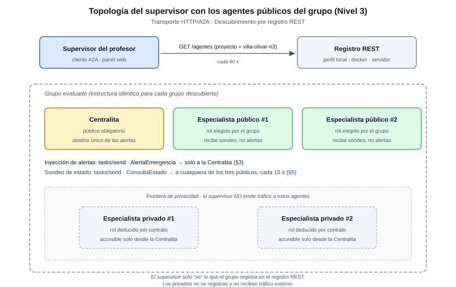
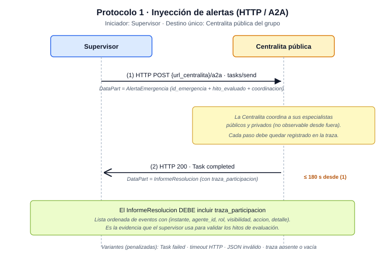
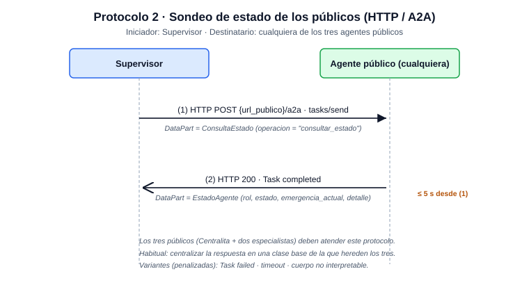
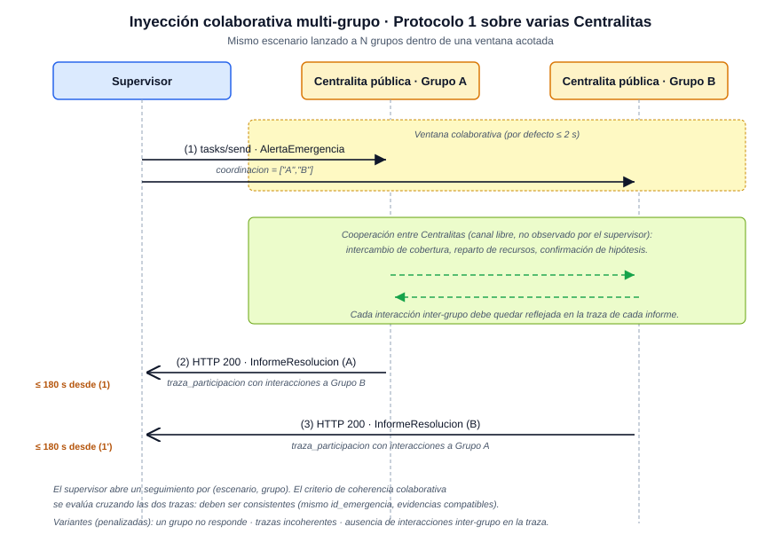

# Contrato del supervisor del profesor — Nivel 3 (entrega final)

> **Documento vinculante para la entrega final del Nivel 3.**
> Define lo mínimo que el sistema multiagente del grupo debe
> respetar para que el supervisor del profesor lo evalúe
> correctamente el **día del examen**. La versión anterior del
> contrato (Nivel 2, transporte XMPP / FIPA-ACL) queda
> únicamente como referencia histórica en la rama
> `agente-profesor-emergencias` y ya no aplica al Nivel 3.

Está dirigido a los grupos: contiene las llamadas A2A exactas, los
modelos Pydantic implicados, los plazos, el detalle del campo
**`traza_participacion`** que cada `InformeResolucion` debe
incluir como evidencia de hitos, el comportamiento esperado en
escenarios colaborativos y las pruebas que el grupo debe escribir.

> El detalle interno del agente supervisor (motivación, plan de
> migración, panel web, persistencia) lo conserva el profesor en
> la rama `agente-profesor-emergencias-nivel3` (documento
> `docs/agente_profesor/plan_adaptacion_nivel3.md`); aquí solo se
> publica el **contrato observable** que cada grupo debe cumplir.

---

## 1. Visión general

El supervisor del profesor es un **cliente A2A asíncrono** (no
SPADE, no XMPP) que se conecta por HTTP a los agentes públicos de
cada grupo. Implementa **dos protocolos** sobre el mismo
transporte y nada más:

1. **Inyección de alertas** — Único iniciador: el supervisor.
   **Único destinatario: la Centralita pública** del grupo.
2. **Sondeo de estado** — Único iniciador: el supervisor.
   Destinatario: **cualquiera de los tres agentes públicos** del
   grupo (Centralita y los dos especialistas públicos).



**Composición del grupo (regla fija del Nivel 3):**

- **3 agentes públicos** registrados en el registro REST:
  - La **Centralita** (rol obligatorio, único punto de entrada de
    alertas).
  - **Dos especialistas públicos** elegidos por el grupo de
    `{bomberos, sanitario, policia, municipal}`.
- **2 agentes privados** completan los cuatro roles especialistas
  pero **no se registran y no son alcanzables** desde el
  supervisor. Su existencia se asume por contrato; su estado no
  se sondea en esta entrega.

**Descubrimiento.** El supervisor no conoce las URL de los agentes
del grupo de antemano: consulta `GET /agentes` al registro REST
del proyecto `villa-olivar` (el namespace del aula) y deduce de allí qué Centralitas
inyectar y qué públicos sondear. Si un grupo no aparece en el
registro, el supervisor no lo evalúa.

**Modelos compartidos.** Los modelos Pydantic vinculantes del
Nivel 3 viven, **única y exclusivamente**, en el paquete
[`contrato/`](../contrato/) de la rama `evaluacion-profesor`. El
grupo los integra en su línea de desarrollo mediante fusión (es
parte de la batería del 25 % de pruebas del profesor descrita en
`doc/HITOS_EVALUACION.md`). Cada modelo se documenta a
continuación con la referencia del fichero que lo define:

| Modelo                            | Fichero                            | Aparece en  |
|-----------------------------------|------------------------------------|-------------|
| `AlertaEmergencia` · `Ubicacion`  | `contrato/alerta_emergencia.py`    | §3.1        |
| `InformeResolucion`               | `contrato/informe_resolucion.py`   | §4          |
| `InformeActuacion`                | `contrato/informe_actuacion.py`    | §4.1        |
| `EventoTraza` · `VisibilidadAgente` · `RolAgente` | `contrato/traza.py` | §4.2 (campo `traza_participacion`) |
| `ConsultaEstado`                  | `contrato/consulta_estado.py`      | §5.1        |
| `EstadoAgente`                    | `contrato/estado_agente.py`        | §5.2        |
| `AgentCard` · `Capacidades` · `Habilidad` | `contrato/agent_card.py`   | §2 (Agent Card) |
| Enumerados (`TipoEmergencia`, `Prioridad`, `RolEspecialista`, `EstadoFinal`, `EstadoTask`) | `contrato/tipos.py` | varios |

> **Aviso para evitar confusión con el Nivel 2.** El fichero
> `ontologia/modelos_compartidos.py` que arrastra el repositorio
> desde el Nivel 2 (modelos `DatosEmergencia`, `RespuestaAgente`,
> etc., con campos como `tipo_mensaje` y `marca_temporal`) **NO se
> utiliza en el Nivel 3**. Está pensado para el transporte
> XMPP/FIPA-ACL y no es compatible con A2A. La fuente única de
> verdad para el Nivel 3 es el paquete `contrato/` de la rama
> `evaluacion-profesor`. Si una prueba del grupo importa de
> `ontologia.modelos_compartidos`, está usando el contrato
> equivocado.

---

## 2. Registro de los agentes públicos

> Esta sección armoniza el contrato del supervisor con el **Hito 1**
> de [`doc/HITOS_EVALUACION.md`](HITOS_EVALUACION.md)
> (*Infraestructura A2A y primer agente*) y con la guía del cliente
> del registro REST
> [`doc/registro_rest_para_clientes.md`](../doc/registro_rest_para_clientes.md)
> de la rama `desarrollo-nivel3`.

Los tres agentes públicos del grupo se dan de alta en el **registro
REST del perfil activo** (declarado en el bloque `registro` de
`config.yaml` mediante `perfil_activo`; el día del examen se usa el
perfil `servidor` y durante el desarrollo el perfil `local`), dentro
del proyecto (`namespace`) `villa-olivar`, mediante
`POST /proyectos/villa-olivar/agentes` al arrancar. A partir del
alta, cada agente mantiene una **señal de vida** (*heartbeat*) cada
**30 s** mientras permanece operativo y se da de baja al apagarse.
Cuando el **TTL de 90 s** expira sin señal, el registro elimina la
entrada y el supervisor deja de ver a ese agente en la ronda
siguiente.

> La URL base del registro (`registro.perfiles.<perfil>.base_url`),
> el modo de despliegue del servicio y cualquier otro parámetro de
> red **no se fijan literalmente** en el contrato: cada grupo los
> lee del `config.yaml` mediante el perfil activo. De este modo el
> contrato permanece estable si la ubicación del registro cambia en
> el futuro.

| Campo del alta    | Valor                                                                       |
|-------------------|------------------------------------------------------------------------------|
| `proyecto`        | `villa-olivar` (namespace del catálogo del aula, fijo para la asignatura)    |
| `grupo`           | Identificador corto del grupo (debe ser el mismo en los tres registros)      |
| `rol`             | `centralita` · `bomberos` · `sanitario` · `policia` · `municipal`            |
| `url_a2a`         | URL HTTP donde el agente atiende `POST /a2a`                                 |
| `url_agent_card`  | URL HTTP de su Agent Card pública (típicamente `{url_a2a}/.well-known/agent.json`) |

**Reglas firmes (armonizadas con el Hito 1):**

- **Composición de los públicos.** La **Centralita 112 es pública
  por contrato y obligatoria** en todos los grupos. Los otros dos
  agentes públicos los elige libremente el grupo de entre
  `{bomberos, sanitario, policia, municipal}`; los dos especialistas
  restantes quedan privados (no se exponen en la red del aula ni se
  registran). Registrar más o menos de tres públicos, repetir un rol
  o no exponer la Centralita invalida la inscripción del grupo para
  esa sesión.
- **Despliegue HTTP en la IP del PC del aula.** Cada uno de los tres
  públicos se ejecuta como un servidor HTTP con `aiohttp` (o
  equivalente) escuchando en la **IP del PC del aula**, **no en
  `localhost`**, para que sea alcanzable desde otros equipos del
  laboratorio (Hito 1, escenario 1 *en condiciones reales*). La
  sesión del examen se ejecuta obligatoriamente sobre los equipos
  del laboratorio docente: un equipo personal no recibe IP del
  esquema de red del aula y queda fuera del alcance de sus pares.
- **Agent Card pública en `/.well-known/agent.json`.** Cada uno de
  los tres públicos publica su Agent Card en
  `GET {url_a2a}/.well-known/agent.json` con los campos mínimos
  exigidos por el Hito 1: `name` (coherente con el `rol`), `url`
  (idéntica a la `url_a2a` registrada), `version`, `capabilities`
  (capacidades A2A soportadas) y `skills` (habilidades del agente,
  coherentes con el rol). En el caso de los especialistas (Hito 2)
  el `skills` describe la habilidad específica del rol.
- **Coherencia entre `config.yaml`, registro y Agent Card.** La
  elección de los dos especialistas que se exponen como públicos
  debe quedar declarada explícitamente en `config.yaml`. La URL
  servida por la Agent Card, la `url_a2a` enviada al registro REST
  y la URL declarada en `config.yaml` deben **coincidir
  literalmente** (Hito 1, escenario 1: *"URL declarada == URL
  servida"*). Cambiar el puerto o el host en `config.yaml` y
  reiniciar debe bastar para que la nueva URL aparezca de forma
  consistente en los tres lugares, sin tocar código fuente
  (Hito 1, escenario 7).
- **Identificador `grupo` compartido.** El campo `grupo` debe
  coincidir en los tres registros públicos del mismo grupo. El
  supervisor agrupa por ese identificador y construye con él las
  entradas de la barra lateral (plan §7.2).
- **Señal de vida y disponibilidad.** Cada público envía su
  *heartbeat* al registro REST cada 30 s; si caducan los 90 s de
  TTL sin recibirla, el registro lo da de baja. Para el supervisor,
  esa baja se traduce en una transición del indicador de presencia
  (*Activo* → *Parcial* / *Ausente*); la entrada del grupo permanece
  en la barra lateral con la leyenda *"caído desde HH:MM:SS"* y
  vuelve a *Activo* automáticamente si el agente se reinscribe (plan
  §7.2). Durante toda la sesión del examen, la URL declarada debe
  ser alcanzable desde la red del laboratorio; direcciones
  inalcanzables se contabilizan como agentes caídos.
- **Autorización por autotoken.** El alta genera el token de
  autorización propio del agente; el cliente lo persiste en
  `.runtime/tokens/{nombre_agente}.token` (con permisos `0o600`) y
  lo reutiliza para los *heartbeats* y la baja. La carpeta
  `.runtime/` **no debe versionarse** (está cubierta por
  `.gitignore`).
- **Privados no se registran.** Los dos especialistas que el grupo
  mantiene privados **no se exponen en la red del aula ni se dan
  de alta en el registro REST** (sea cual sea el perfil activo).
  El mecanismo concreto por el que la Centralita los localiza e
  invoca es decisión del grupo; el supervisor no los ve
  directamente y su intervención queda evidenciada únicamente a
  través de la `traza_participacion` del `InformeResolucion` (§4).

El detalle completo del cliente del registro (endpoints, payloads,
autotoken, perfiles `local` / `servidor`) vive en
[`doc/registro_rest_para_clientes.md`](../doc/registro_rest_para_clientes.md).
Los criterios concretos de validación de la Agent Card y del primer
despliegue de la Centralita vienen del **Hito 1** de
[`doc/HITOS_EVALUACION.md`](HITOS_EVALUACION.md).

---

## 3. Protocolo 1 — Inyección de alertas

Dos pasos en la frontera supervisor ↔ Centralita, con una fase
intermedia de actuación interna del grupo y un único cuerpo de
respuesta (a diferencia del Nivel 2, en A2A no hay un mensaje
`agree` independiente; la confirmación va implícita en el inicio
de la `Task`).



### 3.1. Mensaje (1) — `tasks/send` con `AlertaEmergencia`

Llamada A2A estándar; la `AlertaEmergencia` viaja en el `DataPart`
del primer mensaje de la `Task`.

| Campo de la llamada A2A   | Valor                                            |
|---------------------------|--------------------------------------------------|
| Método HTTP               | `POST`                                           |
| URL                       | `{url_centralita}/a2a` (registrada en el alta)   |
| Método JSON-RPC           | `tasks/send`                                     |
| `params.task.id`          | UUID v4 generado por el supervisor               |
| Parte del mensaje         | `DataPart` con `AlertaEmergencia` como JSON      |

Ejemplo del `DataPart` (lo que el grupo recibirá al deserializar
el primer mensaje de la `Task` con `AlertaEmergencia` de
[`contrato/alerta_emergencia.py`](../contrato/alerta_emergencia.py)):

```json
{
  "id_emergencia": "2efae4fb-ef5e-5920-989d-957b9a511bff",
  "texto": "Humo denso en planta segunda, vecinos evacuados, calle Mayor 14.",
  "ubicacion": {
    "direccion": "Calle Mayor 14, Villa Olivar",
    "latitud": null,
    "longitud": null
  },
  "momento": "2026-05-30T17:32:11.142Z",
  "informador": "coordinador-profesor",
  "hito_evaluado": "H3-E5",
  "coordinacion": ["g1-fenix"]
}
```

Notas sobre los campos (el modelo Pydantic vinculante es
`AlertaEmergencia` de `contrato/alerta_emergencia.py`):

- **`id_emergencia`** (obligatorio, UUID v4): identificador
  correlador del seguimiento. La Centralita debe replicarlo
  literalmente en el `InformeResolucion` resultante (§4) y en
  cada evento de la `traza_participacion` que se refiera a esta
  emergencia.
- **`texto`** (obligatorio, ≥ 3 caracteres): descripción libre de
  la emergencia. **La Centralita es responsable de clasificar**
  el `tipo_emergencia` y la `prioridad` a partir de este texto;
  el contrato del N3 no acepta pre-clasificación y solo deja que
  el resultado de la clasificación aparezca en el
  `InformeResolucion`.
- **`ubicacion`** (opcional): `direccion` textual + `latitud` /
  `longitud` opcionales como floats en grados decimales (no hay
  sub-objeto `coordenadas`).
- **`momento`** (opcional, ISO-8601): instante en que se notifica
  la alerta.
- **`informador`** (opcional): identificador de quien reporta.
- **`hito_evaluado`** (opcional): código del hito que la inyección
  pretende verificar. El grupo no necesita interpretarlo, pero
  **debe reflejarlo en la traza** (véase §4).
- **`coordinacion`** (lista de `id_grupo`, por defecto vacía):
  cuando tiene **un único elemento**, el escenario es individual;
  cuando tiene **dos o más**, es colaborativo (§6). Una lista
  vacía equivale a la lista que contiene solo el id del grupo
  destinatario.

`AlertaEmergencia` declara `extra="ignore"`: cualquier campo no
contemplado en el modelo se descarta silenciosamente al
deserializar.

### 3.2. Mensaje (2) — `Task completed` con `InformeResolucion`

Tras la actuación interna, la Centralita cierra la `Task` con un
último mensaje cuyo `DataPart` contiene el `InformeResolucion`.

| Campo de la respuesta A2A | Valor                                            |
|---------------------------|--------------------------------------------------|
| Código HTTP               | `200 OK` (la `Task` puede terminar `completed` o `failed`) |
| Estado de la `Task`       | `"completed"` (resolución correcta) o `"failed"` (error reportado) |
| Parte del mensaje         | `DataPart` con `InformeResolucion` como JSON     |

**Plazo:** ≤ 180 s desde la recepción del `tasks/send`. El plazo
es generoso a propósito porque los agentes del grupo razonan con
un LLM local; una secuencia de varias llamadas al modelo puede
acumular fácilmente decenas de segundos.

El esquema y el contenido del `InformeResolucion`, en particular
del campo obligatorio `traza_participacion`, se detallan en §4.

### 3.3. Variantes negativas (no recomendadas)

Ante un `tasks/send` con `AlertaEmergencia` válida, una Centralita
correcta **nunca** debe terminar la `Task` en `failed` ni dejarla
sin respuesta. Aunque sus propios agentes —públicos o privados—
no basten para resolver el incidente de forma óptima, la
Centralita **debe entregar la mejor solución posible con los
recursos a su disposición**, marcando el `estado_final` como
`parcial` o `no_resuelta` cuando proceda y dejando constancia de
lo intentado en la `traza_participacion`. Si la Centralita
considera que necesita ayuda para resolver el incidente, **puede
decidir colaborar autónomamente con la Centralita de otro grupo**
(véase §6.4) en lugar de devolver un fallo: esta cooperación
voluntaria es una respuesta válida y se valora positivamente.

El supervisor reconoce y penaliza los siguientes casos:

| Variante                              | Estado en el seguimiento |
|---------------------------------------|---------------------------|
| `Task failed` (la Centralita rechaza el incidente)   | `RECHAZADO` |
| Timeout HTTP (sin respuesta antes del plazo)         | `TIMEOUT`   |
| `DataPart` que no se puede interpretar como `InformeResolucion` | `FALLIDO`   |
| `InformeResolucion` sin `traza_participacion` o con la lista vacía | `INCOMPLETO` |

Cada una de estas situaciones queda **registrada en el log de la
sesión del supervisor** (panel + BD). Sin embargo, el estado
terminal del seguimiento es solo una señal operativa: **el
resultado real de la tarea inyectada se evalúa según los criterios
del hito asociado**, descritos en `doc/HITOS_EVALUACION.md`.
El criterio completo y el papel del log se detallan en §7.

---

## 4. `InformeResolucion` — Campos obligatorios y traza

El `InformeResolucion` es el cuerpo de la respuesta A2A del
Protocolo 1 y **la única evidencia** que el supervisor utiliza
para decidir si el grupo supera el hito asociado a la alerta. Es,
por tanto, **el documento más importante del contrato**.

### 4.1. Campos básicos

El modelo Pydantic vinculante es `InformeResolucion` de
[`contrato/informe_resolucion.py`](../contrato/informe_resolucion.py).
Sus campos:

| Campo                    | Tipo                                  | Reglas                                                                  |
|--------------------------|---------------------------------------|-------------------------------------------------------------------------|
| `id_emergencia`          | UUID                                  | **Idéntico** al de la `AlertaEmergencia` original (correlador).         |
| `tipo_emergencia`        | enum `TipoEmergencia`                 | Clasificación final decidida por la Centralita a partir del `texto` de la alerta. |
| `prioridad`              | enum `Prioridad`                      | Nivel de prioridad asignado por la Centralita tras la coordinación.     |
| `ubicacion`              | `Ubicacion` (opcional)                | Localización confirmada o inferida durante la atención.                 |
| `informes_especialistas` | `list[InformeActuacion]`              | Un elemento por cada especialista convocado. `InformeActuacion` lleva `rol`, `completado`, `acciones_realizadas`, `recursos_empleados`, `observaciones`. |
| `estado_final`           | enum `EstadoFinal`                    | `"resuelta"`, `"parcial"` o `"no_resuelta"`.                            |
| `resumen`                | cadena (opcional)                     | Descripción legible que resume la atención prestada.                    |
| `traza_participacion`    | `list[EventoTraza]`, **min_length=1** | Lista cronológicamente ordenada de eventos. Detalle exhaustivo en §4.2. |

El esquema **no contiene** `tipo_mensaje`, `marca_temporal`,
`agentes_participantes` ni `acciones_realizadas` a nivel raíz: las
acciones por rol viajan dentro de cada `InformeActuacion` (campo
`acciones_realizadas`), y los instantes individuales se reflejan
en cada `EventoTraza` de la `traza_participacion`. Esto evita
duplicar información y permite que la pestaña *Resumen* del panel
del supervisor agregue por rol o por hito sin recorrer textos
libres.

### 4.2. Campo obligatorio — `traza_participacion`

Cada `InformeResolucion` **debe** incluir un campo
`traza_participacion` con una **lista ordenada de eventos** que
documente, paso a paso, qué hizo cada agente del grupo para
resolver el incidente. El modelo Pydantic vinculante es
`EventoTraza` de [`contrato/traza.py`](../contrato/traza.py), y la
lista debe contener al menos un evento (`min_length=1`). Esta
lista es la evidencia que el supervisor cruza con
`doc/HITOS_EVALUACION.md` para validar el hito.

Esquema de cada `EventoTraza`:

| Campo            | Tipo                       | Obligatorio          | Notas                                                              |
|------------------|----------------------------|----------------------|--------------------------------------------------------------------|
| `instante`       | `datetime` ISO-8601        | Sí                   | Orden monótonamente creciente respecto al evento anterior.         |
| `agente_id`      | cadena (≥ 1 carácter)      | Sí                   | Identificador único del agente que actúa (mismo que en el registro para los públicos; interno del grupo para los privados). |
| `rol`            | enum `RolAgente`           | Sí                   | `centralita` · `bomberos` · `sanitario` · `policia` · `municipal`. |
| `visibilidad`    | enum `VisibilidadAgente`   | Sí                   | `publico` o `privado`.                                              |
| `accion`         | cadena `snake_case` (regex `^[a-z_][a-z0-9_]*$`) | Sí | Identificador semántico de la acción (p. ej. `evaluar_situacion`). |
| `detalle`        | cadena (≥ 1 carácter)      | Sí                   | Descripción legible de la acción (mensaje al LLM, decisión tomada).|
| `grupo_externo`  | cadena (≥ 1 carácter)      | Solo en colaborativos| Identifica al grupo con el que se ha intercambiado información (§6). |

Ejemplo de `InformeResolucion` completo coherente con
`contrato/informe_resolucion.py` y `contrato/traza.py`:

```json
{
  "id_emergencia": "2efae4fb-ef5e-5920-989d-957b9a511bff",
  "tipo_emergencia": "incendio",
  "prioridad": "alta",
  "ubicacion": {
    "direccion": "Calle Mayor 14, Villa Olivar",
    "latitud": null,
    "longitud": null
  },
  "informes_especialistas": [
    {
      "rol": "bomberos",
      "completado": true,
      "acciones_realizadas": ["Despliegue de unidad", "Sofocado del incendio"],
      "recursos_empleados": ["unidad_2"],
      "observaciones": null
    },
    {
      "rol": "sanitario",
      "completado": true,
      "acciones_realizadas": ["Evaluación de tres vecinos"],
      "recursos_empleados": ["ambulancia_1"],
      "observaciones": "Sin heridos graves."
    },
    {
      "rol": "policia",
      "completado": true,
      "acciones_realizadas": ["Perímetro establecido"],
      "recursos_empleados": ["patrulla_3"],
      "observaciones": null
    }
  ],
  "estado_final": "resuelta",
  "resumen": "Incendio sofocado, vecinos retornaron a sus viviendas.",
  "traza_participacion": [
    {
      "instante": "2026-05-30T17:32:11.300Z",
      "agente_id": "centralita_fenix",
      "rol": "centralita",
      "visibilidad": "publico",
      "accion": "recibir_alerta",
      "detalle": "AlertaEmergencia recibida vía A2A; id_emergencia=2efae4fb"
    },
    {
      "instante": "2026-05-30T17:32:12.450Z",
      "agente_id": "bomberos_fenix",
      "rol": "bomberos",
      "visibilidad": "publico",
      "accion": "evaluar_situacion",
      "detalle": "Confirma incendio activo en planta segunda"
    },
    {
      "instante": "2026-05-30T17:32:14.020Z",
      "agente_id": "policia_fenix",
      "rol": "policia",
      "visibilidad": "privado",
      "accion": "establecer_perimetro",
      "detalle": "Calle Mayor cortada al tráfico en ambos sentidos"
    },
    {
      "instante": "2026-05-30T17:32:30.500Z",
      "agente_id": "sanitario_fenix",
      "rol": "sanitario",
      "visibilidad": "publico",
      "accion": "atender_evacuados",
      "detalle": "Tres vecinos atendidos por inhalación de humo, sin gravedad"
    },
    {
      "instante": "2026-05-30T17:32:34.700Z",
      "agente_id": "centralita_fenix",
      "rol": "centralita",
      "visibilidad": "publico",
      "accion": "cerrar_incidente",
      "detalle": "Todos los recursos liberados; informe enviado al coordinador"
    }
  ]
}
```

### 4.3. Reglas de validación de la traza

El supervisor aplica las siguientes comprobaciones automáticas a
`traza_participacion`:

1. **No vacía.** Si la lista llega vacía o ausente, el modelo
   Pydantic rechaza el `InformeResolucion` (`min_length=1`) y el
   seguimiento pasa a `INCOMPLETO` aunque el resto del informe
   sea correcto.
2. **Coherencia temporal.** Los `instante` deben ser monótonamente
   crecientes y posteriores (o iguales) al `momento` de la
   `AlertaEmergencia` original. El supervisor no impone una cota
   superior explícita: basta con que la traza termine antes de
   que la respuesta A2A se cierre.
3. **Cobertura de los públicos involucrados.** Cualquier rol que
   aparezca en `informes_especialistas` (sea cual sea su
   visibilidad real en el grupo) debe aparecer al menos una vez
   como `rol` de algún evento de la traza. Análogamente, la
   Centralita siempre debe figurar en la traza con
   `rol = "centralita"` y `visibilidad = "publico"` (al menos en
   los eventos de recepción y cierre).
4. **Acciones identificadas.** El campo `accion` debe usar
   identificadores estables en `snake_case` (validado por el
   regex `^[a-z_][a-z0-9_]*$` del modelo), no descripciones
   libres. El supervisor cuenta ocurrencias por tipo de acción al
   evaluar el hito.
5. **Trazado de los privados.** Cuando un agente privado
   interviene, debe figurar en la traza con
   `visibilidad = "privado"`. Es la **única** forma que tiene el
   supervisor de saber que el grupo ha implementado el privado:
   los privados no se sondean ni se descubren en el registro REST
   (§1).
6. **Trazado de la colaboración inter-grupo.** Cuando el escenario
   es colaborativo (§6), los eventos relacionados con la
   coordinación con otros grupos deben llevar
   `grupo_externo = <id_grupo>` para que el supervisor pueda
   cruzar las trazas de los grupos participantes.

---

## 5. Protocolo 2 — Sondeo de estado de los públicos

El supervisor sondea periódicamente el estado de los **tres
agentes públicos** del grupo para mantener vivo el panel.



### 5.1. Mensaje (1) — `tasks/send` con `ConsultaEstado`

| Campo de la llamada A2A   | Valor                                            |
|---------------------------|--------------------------------------------------|
| Método HTTP               | `POST`                                           |
| URL                       | `{url_publico}/a2a` (la del público al que se sondea) |
| Método JSON-RPC           | `tasks/send`                                     |
| Parte del mensaje         | `DataPart` con `ConsultaEstado` como JSON        |

Modelo Pydantic vinculante: `ConsultaEstado` de
[`contrato/consulta_estado.py`](../contrato/consulta_estado.py).

Ejemplo del `DataPart`:

```json
{
  "operacion": "consultar_estado",
  "rol_destino": "bomberos",
  "momento": "2026-05-30T17:32:50.000Z"
}
```

### 5.2. Mensaje (2) — `Task completed` con `EstadoAgente`

| Campo de la respuesta A2A | Valor                                            |
|---------------------------|--------------------------------------------------|
| Código HTTP               | `200 OK`                                         |
| Estado de la `Task`       | `"completed"`                                     |
| Parte del mensaje         | `DataPart` con `EstadoAgente` como JSON          |

Modelo Pydantic vinculante: `EstadoAgente` de
[`contrato/estado_agente.py`](../contrato/estado_agente.py).

Ejemplo del `DataPart`:

```json
{
  "agente_id": "bomberos_fenix",
  "rol": "bomberos",
  "estado": "ocupado",
  "emergencia_actual": "2efae4fb-ef5e-5920-989d-957b9a511bff",
  "detalle": "Unidad 2 desplazada al lugar del incendio.",
  "momento": "2026-05-30T17:32:50.180Z"
}
```

**Plazo:** ≤ 5 s desde la recepción del `tasks/send`.

Cada uno de los **tres roles públicos** (Centralita y los dos
especialistas que el grupo haya hecho públicos) debe atender este
protocolo. La forma natural es centralizarlo en una clase base
común de la que hereden los tres.

---

## 6. Inyección colaborativa multi-grupo

El día del examen, una parte de los escenarios privados consiste
en lanzar el **mismo** incidente a **dos o más Centralitas
públicas** dentro de una ventana acotada para forzar que los
grupos cooperen entre sí (reparto de recursos, intercambio de
cobertura). El supervisor llama a esta modalidad **inyección
colaborativa**.



### 6.1. Cómo se reconoce un escenario colaborativo

La señal que el grupo recibe está dentro del propio cuerpo de la
`AlertaEmergencia`:

```json
{
  "id_emergencia": "8c5b3e1f-...-...",
  "texto": "Incendio forestal extendido entre dos términos municipales",
  "coordinacion": ["g1-fenix", "g3-quercus"]
}
```

- Cuando `coordinacion` tiene **un único** `id_grupo`, el
  escenario es **individual** y el grupo lo resuelve por sí solo.
- Cuando `coordinacion` tiene **dos o más** `id_grupo`, el
  escenario es **colaborativo**: la Centralita del grupo sabe que
  el mismo incidente ha llegado, dentro de una ventana corta, a
  las Centralitas de los demás grupos listados.

El supervisor garantiza que las llamadas a las distintas
Centralitas se emiten dentro de una **ventana ≤ 2 s** por defecto
(configurable por escenario). El `id_emergencia` es el **mismo**
en todas las inyecciones del lote colaborativo.

### 6.2. Lo que el grupo debe hacer

1. **Reconocer** la modalidad colaborativa al deserializar la
   `AlertaEmergencia` (campo `coordinacion` con > 1 elemento).
2. **Establecer comunicación** con los demás grupos listados. El
   contrato **no fija** el canal: cada grupo puede elegirlo (otra
   llamada A2A directa Centralita-a-Centralita, un protocolo
   ad-hoc, un agente coordinador compartido…). La elección es
   parte de la entrega.
3. **Coordinar** la respuesta: repartir tareas, compartir
   información, evitar la duplicación de recursos.
4. **Reflejar la coordinación en la traza.** Cada interacción con
   un grupo externo debe aparecer como un evento en
   `traza_participacion` con
   `accion = "coordinar_con_grupo"` (u otra acción semántica
   estable elegida por el grupo) y `grupo_externo = <id_grupo>`.
5. **Cerrar la `Task`** con un `InformeResolucion` propio, con su
   propia visión de la resolución y de la coordinación.

### 6.3. Cómo lo evalúa el supervisor

- Abre un seguimiento **por (escenario, grupo destino)**: dos
  Centralitas → dos seguimientos correlacionados por
  `id_emergencia`.
- Para cada grupo, comprueba el `InformeResolucion` con las
  mismas reglas del §4 (incluyendo la traza).
- Adicionalmente, compara las dos trazas y verifica la
  **coherencia colaborativa**: ambos informes deben mencionar las
  interacciones con `grupo_externo` y deben ser consistentes
  entre sí (al menos en el `estado_final`, las acciones de
  coordinación referenciadas y los recursos comprometidos).

### 6.4. Colaboración autónoma en escenarios individuales

Que la `AlertaEmergencia` llegue como **escenario individual**
(`coordinacion` con un único `id_grupo`) **no impide** que la
Centralita destinataria decida pedir ayuda a la Centralita de
otro grupo si entiende que sus propios especialistas —públicos o
privados— no son suficientes para atender el incidente. La
cooperación voluntaria es una **respuesta válida** del Nivel 3 y
se valora positivamente frente a una entrega `parcial` o
`no_resuelta` que renuncie a colaborar.

Reglas mínimas para que esta cooperación quede correctamente
documentada:

- La Centralita iniciadora **descubre por sí misma** a otras
  Centralitas consultando el mismo registro REST que utiliza el
  supervisor (el del perfil activo, §2). No usa ningún canal
  oculto entre grupos.
- La interacción con el grupo externo se invoca enviando una
  `AlertaEmergencia` o un mensaje A2A equivalente a su Centralita
  pública; los grupos no se invocan directamente entre
  especialistas.
- La Centralita iniciadora refleja **cada interacción inter-grupo
  en su `traza_participacion`** con el campo `grupo_externo` (§4):
  el supervisor reconoce y suma esta cooperación al evaluar el
  hito asociado.
- El grupo **receptor de la petición** ajena no figura como
  destinatario del seguimiento que el supervisor abrió para el
  escenario individual: su contribución se ve únicamente a través
  de la traza del informe que devuelve la Centralita iniciadora.

Esta separación es **deliberada**: el supervisor clasifica el
escenario y decide a cuántas Centralitas inyecta (§6.1); la
Centralita decide cómo resolverlo y con quién cooperar. Las dos
decisiones son independientes y compatibles.

---

## 7. Registro de incidencias y criterio de evaluación

### 7.1. Registro de incidencias en el supervisor

Toda desviación del contrato que el supervisor detecte ante una
tarea inyectada —`Task` terminada en `failed`, *timeout* HTTP,
cuerpo no interpretable como `InformeResolucion` o `EstadoAgente`,
`traza_participacion` ausente o vacía, incoherencias temporales
en la traza, falta de cobertura de los públicos involucrados,
ausencia de interacciones inter-grupo en escenarios
colaborativos, etc.— queda **registrada en el log de la sesión
del supervisor**:

- visible en tiempo real en la pestaña *Registro* del panel,
- exportable a CSV (`/supervisor/api/csv/log`),
- persistida junto al resto de la sesión en la BD SQLite.

Para el grupo, esto significa que **ninguna incidencia se evalúa
"de memoria"**: cada inyección deja evidencia reproducible
(`InformeResolucion` recibido, eventos del log, entradas de la
pestaña *Estados de agentes*) que el profesor puede revisar a
posteriori, en la misma sesión o desde el modo consulta sobre la
BD persistida.

### 7.2. Criterio de evaluación de las tareas inyectadas

Los estados terminales en los que un seguimiento aterriza
(`RESUELTO`, `RECHAZADO`, `FALLIDO`, `TIMEOUT`, `INCOMPLETO`)
son la **señal operativa** del supervisor, no la calificación
final del hito. **El resultado de cada tarea inyectada se evalúa
aplicando los criterios concretos del hito asociado**, descritos
en el documento [`doc/HITOS_EVALUACION.md`](HITOS_EVALUACION.md)
del proyecto. El supervisor toma como evidencia el
`InformeResolucion` recibido (y, en particular, su
`traza_participacion` — §4), las observaciones de la pestaña
*Estados de agentes* y las entradas del log de la sesión.

En consecuencia:

- Las **variantes penalizadas** que aparecen en las tablas de
  §3.3 y §5, así como las condiciones de coherencia colaborativa
  de §6, **no son exclusiones automáticas**: señalan
  comportamientos que dificultan o imposibilitan la verificación
  de uno o más hitos, y su peso real depende del criterio de
  cada hito afectado.
- Un `RESUELTO` con traza cumplida no garantiza por sí mismo la
  superación de un hito si la traza no demuestra la cobertura
  específica que ese hito exige (participación de un rol concreto,
  interacciones inter-grupo, secuencia de acciones esperada,
  etc.).
- A la inversa, un seguimiento que el supervisor marque como
  `INCOMPLETO` o `FALLIDO` puede aportar evidencia parcial
  suficiente para superar **partes** de un hito si las acciones
  registradas en la traza cubren los aspectos que ese hito mide.

Es responsabilidad del grupo conocer los hitos descritos en
`doc/HITOS_EVALUACION.md` antes del examen y diseñar la cobertura
de su sistema (acciones, trazas, coordinación) para satisfacer
los criterios concretos de cada uno.

---

## 8. Plazos resumidos

| Variable                   | Valor por defecto | Significado                                          |
|----------------------------|-------------------|------------------------------------------------------|
| `timeout_informe`          | **180 s**         | `tasks/send` (AlertaEmergencia) → `Task completed` con `InformeResolucion`. |
| `timeout_consulta_estado`  | **5 s**           | `tasks/send` (ConsultaEstado) → `Task completed` con `EstadoAgente`.        |
| `ventana_colaborativa`     | **2 s**           | Espacio temporal máximo entre las inyecciones de un mismo escenario colaborativo. |
| `intervalo_sondeo`         | **15 s**          | Frecuencia con la que el supervisor sondea cada público.                    |
| `intervalo_redescubrimiento` | **60 s**        | Frecuencia con la que el supervisor consulta `GET /agentes` al registro.    |

El grupo **no debe acoplarse** a estos valores literalmente: si
los necesita en sus pruebas, debe leerlos de un fichero de
configuración o usarlos como constantes simbólicas. El profesor
se reserva ajustarlos ligeramente entre sesiones, siempre con
margen suficiente.

---

## 9. Pruebas obligatorias del grupo

El grupo debe escribir, como mínimo, **tres pruebas automáticas**
que verifiquen el cumplimiento del contrato sin necesidad de tener
al supervisor real en ejecución. La idea es **simular** las
llamadas del supervisor y comprobar que la Centralita y los demás
públicos responden como deben.

### 9.1. `tests/test_centralita_acepta_alerta.py`

```python
# Verifica el protocolo 1 completo (escenario individual):
# - Centralita expone el endpoint A2A y acepta tasks/send con
#   AlertaEmergencia (coordinacion con un único id_grupo o vacía).
# - La Task termina en 'completed' antes de timeout_informe.
# - El DataPart de la respuesta valida frente a
#   contrato.informe_resolucion.InformeResolucion:
#     * id_emergencia coincide con el de la alerta original
#     * tipo_emergencia y prioridad (clasificación decidida por
#       la Centralita) están dentro del enumerado
#     * estado_final ∈ {resuelta, parcial, no_resuelta}
#     * informes_especialistas es coherente con el tipo
#       (al menos el rol esperado figura como completado=true)
# - traza_participacion contiene al menos un evento (la propia
#   constracción del modelo lo exige por min_length=1).
# - traza_participacion cumple las reglas del §4.3:
#     * orden temporal monótonamente creciente
#     * la Centralita figura con rol='centralita' y
#       visibilidad='publico'
#     * cada rol presente en informes_especialistas aparece como
#       rol de algún EventoTraza
#     * cada accion respeta el regex ^[a-z_][a-z0-9_]*$
```

### 9.2. `tests/test_publicos_responden_sondeo.py`

```python
# Verifica el protocolo 2 para los TRES públicos:
# - Cada uno de los tres públicos (Centralita y los dos
#   especialistas declarados públicos) expone un endpoint A2A
#   que responde a tasks/send con ConsultaEstado.
# - La Task termina en 'completed' antes de timeout_consulta_estado.
# - El DataPart de la respuesta parsea como EstadoAgente válido.
# - El campo 'agente_id' del cuerpo identifica correctamente al
#   agente que responde.
```

### 9.3. `tests/test_centralita_acepta_alerta_colaborativa.py`

```python
# Verifica el comportamiento colaborativo (§6):
# - Centralita reconoce que coordinacion tiene > 1 id_grupo y
#   distingue la modalidad colaborativa.
# - La Centralita establece (o intenta establecer) la
#   comunicación con los grupos listados — al menos un evento de
#   traza_participacion con grupo_externo presente.
# - El InformeResolucion final contiene al menos una acción de
#   coordinación reflejada en la traza con grupo_externo.
# - id_emergencia coincide con la alerta colaborativa original.
```

Las tres pueden usar `pytest-aiohttp` o `pytest-httpx` para
simular las llamadas A2A entrantes (la cabecera JSON-RPC y el
`DataPart`); lo importante es que **no requieran al supervisor
real**: deben pasar con `pytest tests/ -v` antes de la entrega.

---

## 10. Cómo probarse antes del examen

El profesor proporciona el supervisor (`profesor_main.py`) y los
escenarios del **catálogo público** de hitos, que viven en
`agente_profesor/escenarios/publicos/` y son **inspeccionables**
por el grupo (un fichero YAML por escenario). Esto permite a cada
grupo autoevaluarse contra exactamente la misma infraestructura
que se usará el día del examen, salvo por los escenarios del
catálogo de examen, que el profesor copia a
`agente_profesor/escenarios/examen/` únicamente el día de la
sesión y borra al terminar.

Pasos típicos:

1. **Levantar la pila de infraestructura** (registro REST + LLM)
   según las instrucciones del repositorio
   `ssmmaa-infraestructura`. En autoevaluación se utiliza el
   perfil **`local`** del bloque `registro` de `config.yaml`; la
   URL base concreta del registro la fija ese perfil, no este
   contrato.

2. **Arrancar los agentes públicos del grupo**, asegurándose de
   que los tres se registran correctamente contra el registro
   REST del perfil activo (proyecto `villa-olivar`) con el mismo
   campo `grupo` y publicando su Agent Card en
   `/.well-known/agent.json` (véase §2).
3. **Lanzar el supervisor del profesor** indicando el mismo perfil
   de registro que están usando los agentes del grupo:

   ```bash
   python profesor_main.py --modo activo --perfil-registro local
   ```

   Para reproducir las condiciones de la sesión del examen se usa
   el perfil **`servidor`** (mismo binario, distinto perfil); en
   ambos casos el binario es idéntico y la diferencia está sólo
   en `config.yaml`.

4. **Abrir el panel** del supervisor (la URL la imprime el propio
   binario al arrancar) y comprobar que el grupo aparece en la
   barra lateral con su composición pública correcta.
5. **Inyectar** escenarios del catálogo público desde el botón
   *"Probar escenario"* y verificar, en cada caso, que el
   seguimiento termina en verde y que la pestaña *Detalle* muestra
   un `InformeResolucion` con la traza completa.

Si el grupo respeta este contrato (incluyendo el campo
`traza_participacion`), su sistema pasará la corrección del Nivel 3
sin sorpresas.
