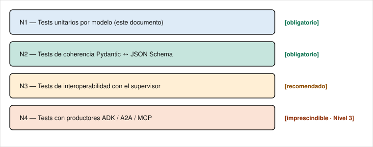
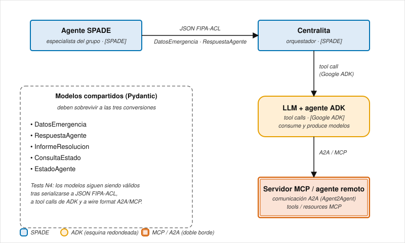
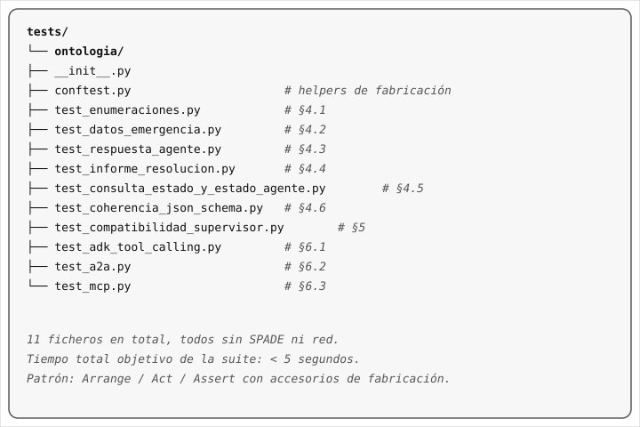

# Propuesta de pruebas unitarias para la ontología

**Asignatura:** Sistemas Multiagente — Universidad de Jaén

**Componente:** `ontologia/modelos_compartidos.py` y los esquemas
JSON asociados (`esquema_emergencias.json`,
`esquema_supervisor.json`).

**Destinatario:** Estudiantes que abordan la transición del **Nivel 2**
(SPADE + Pydantic) al **Nivel 3** (integración completa con Google
ADK, A2A y MCP).

**Estado:** Documento guía. La implementación de las pruebas es
**responsabilidad del grupo** como parte de la entrega del Nivel 3.

> **Aviso de alcance.** Esta propuesta cubre los modelos del
> **Nivel 2** (`ontologia/modelos_compartidos.py`, transporte
> FIPA-ACL sobre XMPP). En el **Nivel 3** el contrato externo
> vinculante vive en el paquete `contrato/` de la rama
> `evaluacion-profesor` (`AlertaEmergencia`, `InformeResolucion`,
> `EventoTraza`, `ConsultaEstado`, `EstadoAgente`, `AgentCard`).
> Las pruebas sobre los modelos del Nivel 3 ya están redactadas
> por el profesor y viajan en la misma rama, bajo
> `tests/profesor/modelos/`; el grupo las recibe al fusionar la
> rama y debe hacerlas pasar como parte de la batería del 25 %
> descrita en `doc/HITOS_EVALUACION.md`. Las pruebas que se
> describen a continuación complementan a las anteriores
> verificando los modelos heredados del Nivel 2; son **opcionales
> para la entrega del Nivel 3** y se conservan como referencia
> para los grupos que mantengan agentes SPADE en paralelo.

---

## 1. Por qué probar la ontología

La ontología es el **contrato** entre tres mundos:

1. Los agentes SPADE del Nivel 1, que envían y reciben mensajes
   FIPA-ACL cuyo cuerpo se serializa contra estos modelos.
2. El supervisor del profesor, que valida `InformeResolucion` con
   `model_validate` antes de transicionar un seguimiento a
   `RESUELTO`.
3. Los agentes ADK del Nivel 3, que **consumen y producen** los
   mismos modelos a través de llamadas a herramientas (*tool calls*),
   A2A y servidores MCP.

Si la ontología cambia entre niveles sin garantías, la cadena se
rompe en silencio: un campo renombrado en un modelo Pydantic puede
hacer que el supervisor descarte como `FALLIDO` un informe que el
grupo considera correcto, o que una llamada a herramienta de ADK
serialice un JSON que el agente especialista de SPADE no es capaz
de aceptar.

Probar la ontología tiene tres objetivos:

- **Bloquear regresiones**: cualquier cambio que rompa el contrato
  observable hace fallar la prueba antes de que llegue a la
  ejecución.
- **Documentar con código**: cada prueba es un ejemplo ejecutable
  de qué se considera mensaje válido y qué no.
- **Servir de puente al Nivel 3**: las mismas pruebas deben pasar
  cuando el productor del mensaje sea un agente ADK en lugar de un
  agente SPADE.

---

## 2. Inventario actual

### 2.1 Enumeraciones

| Enumeración        | Valores |
|--------------------|---------|
| `TipoEmergencia`   | `incendio`, `derrame_quimico`, `accidente_trafico`, `inundacion`, `derrumbe`, `otro` |
| `Prioridad`        | `baja`, `media`, `alta`, `critica` |
| `EstadoActuacion`  | `recibido`, `en_camino`, `en_escena`, `actuando`, `finalizado`, `requiere_apoyo` |

### 2.2 Modelos Pydantic

| Modelo               | `tipo_mensaje`        | Performativa típica | Productor → Consumidor |
|----------------------|-----------------------|---------------------|------------------------|
| `DatosEmergencia`    | `alerta_emergencia`   | `request`           | Supervisor → Centralita |
| `RespuestaAgente`    | `informe_actuacion`   | `inform`            | Especialista → Centralita |
| `InformeResolucion`  | `informe_resolucion`  | `inform`            | Centralita → Supervisor |
| `ConsultaEstado`     | `consulta_estado`     | `query-ref`         | Supervisor → Cualquier agente |
| `EstadoAgente`       | `estado_agente`       | `inform`            | Cualquier agente → Supervisor |

### 2.3 Esquemas JSON (*JSON Schema*)

`esquema_emergencias.json` (mensajes intra-grupo) y
`esquema_supervisor.json` (mensajes con el supervisor) son la
**fuente de verdad textual** de la ontología. Las pruebas deben
verificar que los modelos Pydantic son compatibles con los esquemas
JSON, detectando cualquier desfase entre las dos representaciones.

---

## 3. Estrategia de prueba

### 3.1 Niveles



*Fuente: [`imagenes/niveles_test.svg`](imagenes/niveles_test.svg).*

### 3.2 Patrón de prueba

```python
def test_<modelo>_<propiedad_que_se_verifica>():
    # 1. Preparar (Arrange): construir un cuerpo crudo (dict) o un
    #    modelo válido.
    # 2. Ejecutar (Act): aplicar la operación
    #    (model_validate, model_dump, ...).
    # 3. Verificar (Assert): comprobar el resultado o que se lanza
    #    la excepción esperada (con pytest.raises(ValidationError)).
```

### 3.3 Convenciones

- Nombres en español, en `snake_case`, con la propiedad verificada
  como sufijo:
  `test_datos_emergencia_rechaza_prioridad_invalida`.
- Una aserción por prueba siempre que sea posible. Cuando se
  compruebe la serialización completa, agrupar las aserciones bajo
  una misma prueba con un comentario que indique las variantes.
- Funciones auxiliares de fabricación
  (`_construir_alerta_valida()`,
  `_construir_informe_resolucion_valido()`) para no duplicar los
  diccionarios válidos en cada prueba. Residen en
  `tests/ontologia/conftest.py`.
- Usar pruebas parametrizadas (`@pytest.mark.parametrize`) para los
  casos enumerados (una prueba por valor válido del enumerado, una
  prueba parametrizada por valor no válido).

---

## 4. Catálogo de pruebas por modelo

Cada bloque siguiente lista las pruebas **mínimas** que se esperan
en la entrega del Nivel 3. Las marcadas con (★) son obligatorias;
el resto son recomendadas.

### 4.1 Enumeraciones

#### `TipoEmergencia`, `Prioridad`, `EstadoActuacion`

- (★) `test_<enum>_contiene_los_valores_esperados` — asegurar que
  el conjunto de valores no cambia silenciosamente entre versiones.
  Ejemplo:

  ```python
  def test_tipo_emergencia_contiene_los_valores_esperados():
      esperados = {
          "incendio", "derrame_quimico", "accidente_trafico",
          "inundacion", "derrumbe", "otro",
      }
      assert {t.value for t in TipoEmergencia} == esperados
  ```

- (★) `test_<enum>_acepta_valor_canonico` — `Prioridad("alta")`
  devuelve el miembro correcto.
- (★) `test_<enum>_rechaza_valor_desconocido` —
  `Prioridad("urgente")` lanza `ValueError`.
- `test_<enum>_distingue_mayusculas_y_minusculas` —
  `Prioridad("Alta")` falla; documenta que la ontología distingue
  mayúsculas de minúsculas (*case sensitive*).

### 4.2 `DatosEmergencia`

Construcción y validación:

- (★) `test_datos_emergencia_construccion_minima_es_valida` —
  ejemplo con todos los campos obligatorios.
- (★) `test_datos_emergencia_marca_temporal_se_genera_si_no_se_pasa`
  — el `default_factory=datetime.now` produce una fecha reciente.
- (★) `test_datos_emergencia_tipo_mensaje_por_defecto_es_alerta_emergencia`.
- (★) `test_datos_emergencia_rechaza_prioridad_invalida` —
  `pytest.raises(ValidationError)` cuando `prioridad="urgente"`.
- (★) `test_datos_emergencia_rechaza_tipo_emergencia_invalido`.
- `test_datos_emergencia_acepta_marca_temporal_iso_string` —
  Pydantic v2 admite cadenas en formato ISO 8601 en los campos de
  tipo `datetime` cuando se usa `model_validate`; documentarlo con
  una prueba.

Serialización:

- (★) `test_datos_emergencia_ida_y_vuelta_json` (en inglés *round
  trip*) —
  `DatosEmergencia.model_validate_json(d.model_dump_json()) == d`.
- `test_datos_emergencia_dump_incluye_marca_temporal_iso8601` — el
  campo se serializa como cadena ISO con `mode="json"`.

Extensión por herencia (Nivel 3):

- (★) `test_datos_emergencia_admite_subclase_con_campos_extra` —
  un grupo crea `DatosEmergenciaConGPS(DatosEmergencia)` y la
  validación sigue funcionando para los campos base.

### 4.3 `RespuestaAgente`

- (★) `test_respuesta_agente_acepta_todos_los_estados_actuacion`
  (parametrizada con cada miembro del enumerado).
- (★) `test_respuesta_agente_rechaza_estado_no_listado`.
- (★) `test_respuesta_agente_recursos_desplegados_es_lista`.
- `test_respuesta_agente_recursos_desplegados_por_defecto_lista_vacia`.
- `test_respuesta_agente_id_emergencia_es_obligatorio`.

### 4.4 `InformeResolucion` (modelo crítico — el supervisor lo valida)

- (★) `test_informe_resolucion_valido_pasa_model_validate`.
- (★) `test_informe_resolucion_falta_resumen_lanza_validation_error`.
- (★) `test_informe_resolucion_tipo_emergencia_debe_ser_enum`.
- (★) `test_informe_resolucion_acciones_realizadas_es_lista_de_cadenas`.
- (★) `test_informe_resolucion_se_serializa_a_dict_para_sqlite` —
  `model_dump(mode="json")` produce un diccionario con todos los
  campos serializables (sin objetos `datetime` crudos).
- `test_informe_resolucion_es_coherente_con_alerta_original` —
  función auxiliar que construye una `DatosEmergencia` y un
  `InformeResolucion` con los mismos `id_emergencia`,
  `tipo_emergencia` y `prioridad` (replica la comprobación que
  hace el receptor del supervisor).

### 4.5 `ConsultaEstado` y `EstadoAgente`

- (★) `test_consulta_estado_obliga_agente_destino`.
- (★) `test_estado_agente_emergencia_actual_es_optional`.
- (★) `test_estado_agente_serializa_correctamente_con_emergencia_none`.
- `test_estado_agente_estado_es_cadena_libre` — `estado` no está
  enumerado por diseño (los grupos pueden añadir vocabulario
  propio).

### 4.6 Esquemas JSON (coherencia Pydantic ↔ JSON)

Pruebas N2 — cruzar las dos representaciones.

- (★) `test_modelo_pydantic_compatible_con_json_schema` — para cada
  modelo, generar un JSON con `model.model_dump(mode="json")` y
  validarlo con `jsonschema.validate` contra la definición del
  esquema correspondiente.

  ```python
  import json, jsonschema
  from pathlib import Path

  RUTA_ESQUEMA = Path("ontologia/esquema_emergencias.json")
  esquema = json.loads(RUTA_ESQUEMA.read_text())

  def test_alerta_emergencia_pydantic_es_valida_para_json_schema():
      alerta = _construir_alerta_valida()
      datos = alerta.model_dump(mode="json")
      jsonschema.validate(
          instance=datos,
          schema=esquema["definitions"]["alerta_emergencia"],
      )
  ```

- (★) `test_json_invalido_es_rechazado_por_pydantic_y_jsonschema` —
  un cuerpo mal formado debe ser rechazado por **ambas** vías. Si
  una sí lo acepta y la otra no, hay desfase.
- `test_enums_pydantic_coinciden_con_enum_json_schema` — comparar
  los conjuntos de valores literales para que añadir un nuevo
  `TipoEmergencia` en Pydantic obligue a actualizar también el
  esquema JSON.

---

## 5. Pruebas de interoperabilidad con el supervisor (N3)

Estas pruebas residen mejor en
`tests/ontologia/test_compatibilidad_supervisor.py` y validan que
los modelos generados por el grupo son aceptables para el
supervisor del profesor (caja negra cuya implementación no deben
tocar).

- (★) `test_informe_resolucion_construido_por_alumno_es_valido` —
  el grupo construye un `InformeResolucion`, lo serializa, y
  comprueba que `InformeResolucion.model_validate(json.loads(...))`
  no lanza. Sirve de prueba rápida de validación
  (en inglés *smoke test*) antes de cada corrección.
- (★) `test_informe_coherente_pasa_chequeo_del_receptor` —
  reproducir la lógica del receptor (`tipo_emergencia` y
  `prioridad` iguales a la solicitud) sobre un par alerta + informe
  construido por el grupo.
- `test_estado_agente_aceptable_por_sondeo` — aplicar
  `EstadoAgente.model_validate(...)` a la salida del agente en
  reposo y en activo.

---

## 6. Pasarela al Nivel 3 (N4 — imprescindible)

En el Nivel 3 los modelos se mueven entre **tres ecosistemas**:



*Fuente: [`imagenes/flujo_nivel3.svg`](imagenes/flujo_nivel3.svg).*

Las pruebas N4 validan que la ontología sobrevive a estas
conversiones. Cada una se materializa con un accesorio (*fixture*)
que simula el productor correspondiente (no se necesita el modelo
de lenguaje real; basta con generar el JSON canónico que
produciría).

### 6.1 Pruebas de llamadas a herramientas (*tool calls*) de ADK

- (★) `test_alerta_construida_por_tool_call_es_valida` — emular el
  JSON con el que una llamada a herramienta de ADK rellenaría una
  `DatosEmergencia` y verificar que `model_validate` no lanza.
- (★) `test_respuesta_de_herramienta_estado_agente_es_valida` — la
  respuesta esquematizada de la herramienta `consultar_estado`
  cumple `EstadoAgente`.
- `test_tool_call_omite_marca_temporal_y_se_rellena_por_defecto` —
  los modelos de lenguaje (*Large Language Models*, LLM) tienden a
  omitir campos con valor por defecto; comprobar que la validación
  los rellena por sí sola.

### 6.2 Pruebas de comunicación entre agentes (A2A — *Agent2Agent*)

- (★) `test_mensaje_a2a_serializa_y_deserializa_informe_resolucion`
  — un agente ADK envía a otro un `InformeResolucion`; el receptor
  lo recupera idéntico (`==`) tras pasar por el formato de
  transporte (en inglés *wire format*) de A2A.
- `test_metadatos_a2a_no_contaminan_el_modelo` — el envoltorio
  (en inglés *wrapper*) de A2A añade campos como `task_id`;
  comprobar que no se filtran al modelo Pydantic.

### 6.3 Pruebas MCP (*Model Context Protocol*)

- (★) `test_servidor_mcp_devuelve_estado_agente_valido` — el
  recurso MCP `estado://<rol>/<grupo>` devuelve un JSON que cumple
  `EstadoAgente`.
- (★) `test_herramienta_mcp_acepta_alerta_emergencia` — la
  herramienta MCP `inyectar_alerta` rechaza cargas útiles
  (en inglés *payloads*) con `prioridad` no válida con un error
  claro (no con un fallo no controlado).

### 6.4 Pruebas entre protocolos (extra)

- `test_informe_generado_en_adk_es_aceptado_por_supervisor_spade`
  — flujo de extremo a extremo mínimo: ADK construye el informe,
  se serializa, llega al supervisor SPADE, y este lo acepta como
  `RESUELTO`.

---

## 7. Estructura de directorio propuesta



*Fuente: [`imagenes/estructura_directorio.svg`](imagenes/estructura_directorio.svg).*

`conftest.py` debe exponer al menos:

```python
def _construir_alerta_valida() -> DatosEmergencia: ...
def _construir_respuesta_agente_valida() -> RespuestaAgente: ...
def _construir_informe_resolucion_valido(
    alerta: DatosEmergencia | None = None,
) -> InformeResolucion: ...
def _construir_estado_agente_valido() -> EstadoAgente: ...
```

---

## 8. Cobertura mínima exigida en la entrega

Para que la entrega del Nivel 3 se considere completa, el conjunto
de pruebas debe cumplir todos estos puntos:

- ✅ Todas las pruebas **(★)** de las secciones §4.1 a §4.5
  implementadas.
- ✅ Al menos las dos pruebas **(★)** de coherencia con el esquema
  JSON (§4.6).
- ✅ Las dos pruebas **(★)** de compatibilidad con el supervisor (§5).
- ✅ Al menos una prueba **(★)** por cada tecnología del Nivel 3:
  llamada a herramienta de ADK, A2A y MCP (§6).
- ✅ El conjunto completo pasa con `pytest tests/ontologia/ -v` sin
  pruebas omitidas (`SKIPPED`).
- ✅ El tiempo total se mantiene **por debajo de 5 segundos**: si
  una prueba necesita un servidor real (MCP, A2A), debe usar un
  servidor sustitutivo (en inglés *fake*) en el mismo proceso.

---

## 9. Errores frecuentes que estas pruebas deben atrapar

Lista de fallos reales observados en cursos anteriores. Cada uno
debería caer con al menos una prueba del catálogo:

1. **Cambiar el valor literal de un enumerado** (por ejemplo, usar
   `"INCENDIO"` en mayúsculas en el JSON producido). Capturado por
   §4.1 (`test_<enum>_distingue_mayusculas_y_minusculas`) y §4.2.
2. **Omitir `tipo_mensaje` o usar uno distinto** en un mensaje
   producido por ADK. Capturado por §4.4 (ida y vuelta JSON).
3. **Renombrar un campo en una subclase del grupo**
   (`agente_origen` → `origen`). Capturado por §4.3 y §5.
4. **Devolver `marca_temporal` como objeto `datetime`** sin
   serializar a cadena en mensajes JSON. Capturado por §4.4
   `_se_serializa_a_dict_para_sqlite`.
5. **Generar un `InformeResolucion` con `tipo_emergencia` distinto
   del de la solicitud** (cuando el modelo de lenguaje «decide»
   reclasificar el incidente). Capturado por §5
   `_pasa_chequeo_del_receptor`.
6. **Esquema JSON y modelos Pydantic divergentes** tras añadir un
   campo solo a un lado. Capturado por §4.6.
7. **Llamadas a herramienta de ADK con `prioridad: null`** porque
   el modelo de lenguaje omite el campo. Capturado por §6.1.

---

## 10. Reglas de mantenimiento

- Cada nuevo campo en `modelos_compartidos.py` debe ir acompañado
  de **al menos dos pruebas** (una positiva y una negativa).
- Las pruebas son parte del contrato: si rompes una prueba al
  reorganizar la ontología, **piénsalo dos veces**;
  probablemente estés rompiendo la entrega de otro grupo o el
  supervisor.
- Si una prueba del Nivel 3 (§6) falla pero las del Nivel 2
  (§4–§5) pasan, el problema está en la integración con
  ADK / A2A / MCP, no en la ontología.

---

## 11. Cierre

Este catálogo no pretende ser exhaustivo: pretende ser
**suficiente** para que un grupo que llegue al Nivel 3 disponga de
una red de seguridad antes de empezar a integrar Google ADK, A2A y
MCP. Cada grupo puede añadir pruebas adicionales —especialmente
sobre los modelos extendidos por herencia que su Centralita
necesite—, pero las marcadas con **(★)** son la línea base mínima
para considerar la ontología «probada» en la entrega.

Cuando se confirme este documento, los grupos pueden empezar a
implementar el conjunto de pruebas siguiendo la estructura del §7. El
documento gemelo con los patrones de prueba del agente del profesor
(`docs/agente_profesor/testing_profesor.md`) vive en la rama
`agente-profesor-emergencias`.
