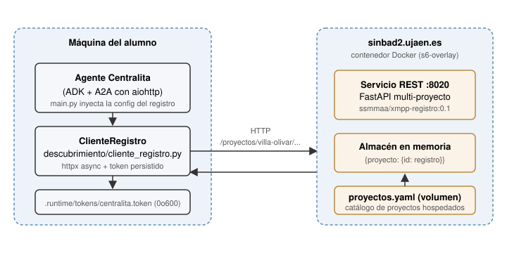
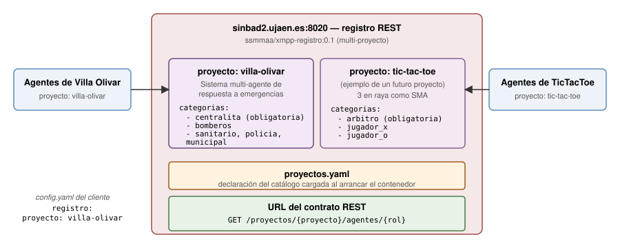
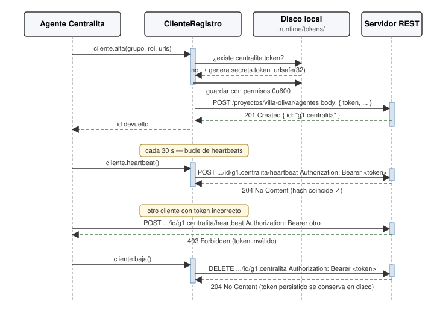

# El servicio REST de registro — guía para Villa Olivar

> Este documento explica el **servicio REST de registro de agentes** desde
> el punto de vista de un cliente: qué hace, por qué lo usamos en
> Villa Olivar y cómo lo consume el código del agente. La discusión de
> diseño y la implementación del servicio viven en una rama separada
> (`infraestructura-registro-rest`); esta guía contiene únicamente lo que
> el desarrollador del cliente necesita saber.

---

## 1. Para qué sirve

El registro REST es un **directorio centralizado de agentes públicos** de
los proyectos de la asignatura. Cuando un agente arranca, se da de alta en
él indicando su rol, su URL A2A y su grupo. Cuando otro agente necesita
descubrir, por ejemplo, qué bomberos hay disponibles ahora mismo en el
aula, consulta al registro y obtiene una lista con sus URL.

En Villa Olivar lo usan los **tres agentes públicos del grupo** (la
Centralita y los dos especialistas elegidos como públicos): se dan de alta
al arrancar, mantienen una **señal de vida** (*heartbeat*) cada 30 s mientras están operativos y se
dan de baja al apagarse. Otros grupos del aula los descubren consultando
el registro por categoría.



El servicio está **hospedado en `sinbad2.ujaen.es:8020`** y es alcanzable
desde cualquier punto de Internet, así que los agentes no necesitan estar
en la misma red para encontrarse.

---

## 2. Cómo lo usa un agente de Villa Olivar

Toda la interacción con el registro pasa por la clase `ClienteRegistro`
de `descubrimiento/cliente_registro.py`. El agente no construye URL ni
maneja JSON: instancia el cliente con su perfil y llama a métodos de alto
nivel.

```python
from descubrimiento.cliente_registro import ClienteRegistro

# Las URL base y el proyecto los inyecta main.py desde config.yaml.
cliente = ClienteRegistro(
    base_url="http://sinbad2.ujaen.es:8020",
    proyecto="villa-olivar",
    nombre_agente="centralita",
)

# Alta al arrancar el agente
await cliente.alta(
    grupo="g1",
    rol="centralita",
    url_a2a="http://192.168.1.11:8110",
    url_agent_card="http://192.168.1.11:8110/.well-known/agent.json",
)

# Señales de vida periódicas en una tarea de fondo
await cliente.arrancar_heartbeats()

# Descubrir bomberos operativos en cualquier momento
bomberos = await cliente.descubrir(rol="bomberos")
for b in bomberos:
    print(b["id"], "→", b["url_a2a"])

# Cierre ordenado al apagarse
await cliente.parar_heartbeats()
await cliente.baja()
await cliente.aclose()
```

Las referencias completas:
- Código: [`descubrimiento/cliente_registro.py`](../descubrimiento/cliente_registro.py).
- Tests: [`tests/test_cliente_registro.py`](../tests/test_cliente_registro.py).

---

## 3. Modelo multi-proyecto

El servicio **no es exclusivo de Villa Olivar**: hospeda varios proyectos
de la asignatura en paralelo, cada uno con su propio catálogo cerrado de
categorías. Por eso la URL de cada operación lleva el segmento
`/proyectos/{proyecto}/...` — sirve para que el servidor sepa contra qué
catálogo tiene que validar el `rol` que envía el agente.



Para Villa Olivar el catálogo declarado en el servidor es:

| Categoría (`rol`) | Notas |
|-------------------|-------|
| `centralita` | obligatoria |
| `bomberos` |
| `sanitario` |
| `policia` |
| `municipal` |

Cualquier intento de dar de alta un `rol` que no esté en este catálogo
recibe **400 Bad Request** con la lista de categorías válidas en el
cuerpo. El servicio no impone qué dos especialistas eliges como públicos:
eso es decisión del grupo.

---

## 4. Autorización por autotoken

El servicio no usa autenticación pre-compartida (ningún token
distribuido por el profesor antes del examen). En su lugar, **cada agente
genera su propio token al darse de alta y el registro guarda el hash
SHA-256 de ese token**. A partir de ese momento, sólo el agente que
conoce el token puede actualizar (señal de vida) o eliminar (baja) su entrada.
Esto evita que otro alumno pueda manipular agentes que no ha creado él
aunque conozca el `id`.



**El cliente gestiona el token automáticamente:**

- Lo genera con `secrets.token_urlsafe(32)` la primera vez que se
  ejecuta (en el método `alta`).
- Lo persiste en `.runtime/tokens/{nombre_agente}.token` con permisos
  `0o600` para que sólo el propietario lo pueda leer.
- Lo reutiliza en arranques posteriores: si reinicias la Centralita,
  recuperas la misma identidad y puedes seguir enviando señales de vida o
  darla de baja sin necesidad de un nuevo alta.

El alumno **no debe imprimir, loguear ni cometear** el contenido de
`.runtime/tokens/`. La carpeta `.runtime/` está en `.gitignore` para
evitarlo accidentalmente.

**Operaciones públicas vs. autenticadas:**

| Operación | Autenticación |
|-----------|----------------|
| `descubrir(rol)` | abierta (cualquiera puede consultar) |
| `alta(...)` | el cliente envía el token nuevo en el body |
| `heartbeat()` | `Authorization: Bearer <token>` (el del alta) |
| `baja()` | `Authorization: Bearer <token>` |

---

## 5. Configuración del cliente en `config.yaml`

La sección `registro` de `config.yaml` recoge dónde vive el servicio y
qué proyecto somos:

```yaml
registro:
  perfil_activo: "servidor"          # "local" | "servidor"
  proyecto: "villa-olivar"           # namespace del servidor
  perfiles:
    local:
      base_url: "http://localhost:8020"
    servidor:
      base_url: "http://sinbad2.ujaen.es:8020"
  heartbeat_segundos: 30             # frecuencia de las señales de vida
  ttl_segundos: 90                   # TTL antes de baja automática
  timeout_segundos: 5                # tiempo de espera de las llamadas HTTP
```

Por defecto el perfil activo es `servidor`: el cliente apunta a
`sinbad2.ujaen.es:8020`. Cambiar a `local` sólo tiene sentido si has
clonado la rama `infraestructura-registro-rest` y has levantado tu
propia copia del servicio en localhost (para experimentar con un
catálogo de proyectos propio sin tocar el del aula).

`main.py` lee este bloque y se lo pasa a cada agente cuando lo arranca.
**Nunca pongas URL del registro hardcoded en el código** del agente: se
leen siempre del perfil activo.

---

## 6. Para profundizar

El **código fuente del servicio**, el plan operativo de implementación,
los runbooks de despliegue y la discusión completa de diseño viven en
la rama [`infraestructura-registro-rest`](../../tree/infraestructura-registro-rest):

- `registro/app.py`, `modelos.py`, `almacen.py`, `proyectos.py` — la
  implementación FastAPI multi-proyecto.
- `registro/Dockerfile` y `registro/s6/` — empaquetado en una imagen
  Docker que combina Prosody + el registro supervisados por
  `s6-overlay`.
- `registro/despliegue/` — runbooks `desplegar.md` y `migracion_sinbad2.md`,
  script `verificar_servicio.sh` con 23 chequeos end-to-end.
- `doc/discusion_servicio_registro_rest.md` — diseño completo y
  decisiones cerradas.
- `doc/plan_implementacion_registro_rest.md` — plan operativo paso a paso.

Como cliente de Villa Olivar **no necesitas leer nada de eso** para
construir tus agentes: te basta con esta guía y el `ClienteRegistro`.
La rama de infraestructura existe para el profesor y para quien quiera
extender el servicio (añadir un proyecto nuevo al catálogo, levantar
una instancia propia, etc.).
